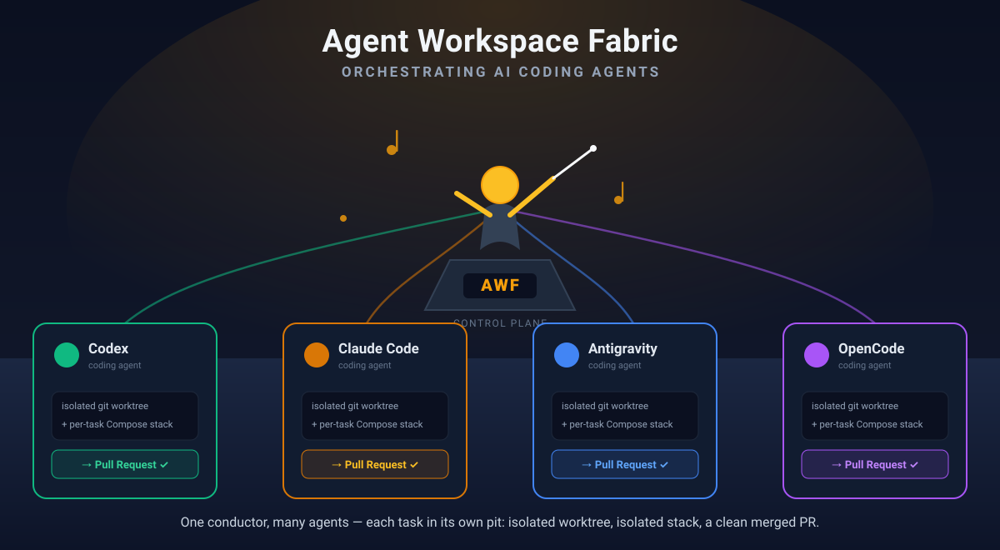

# Agent Workspace Fabric (AWF)

[](https://github.com/dimileeh/agent-workspace-fabric/actions/workflows/ci.yml)
[](LICENSE)
[](pyproject.toml)
[](https://github.com/dimileeh/agent-workspace-fabric/actions/workflows/ci.yml)




📐 **[Interactive architecture diagram](docs/architecture.html)** &nbsp;·&nbsp; 🧭 **[Concepts &amp; glossary](docs/CONCEPTS.md)** &nbsp;·&nbsp; 🚀 **[Quickstart](docs/QUICKSTART.md)**

**AWF is an industrial workspace fabric for AI coding agents.**

It gives Codex, Claude Code, Gemini, and future coding agents a repeatable way
to work like disciplined software contributors: each task gets an isolated
workspace, a clean checkout, declared services, validation, PR creation, PR
review monitoring, comment-fix loops, merge gates, artifacts, events, and
cleanup.

AWF is not a chatbot and not a product-planning brain. It is the execution
substrate beneath a planner, a human operator, or an MCP client; inside a
workspace it can enforce a concrete implementation-plan lifecycle.

## The Problem

AI coding agents can write code, but raw agent execution does not scale to a
real engineering workflow.

Without a workspace fabric, parallel agent development quickly runs into the
same operational failures:

- Agents share local state, credentials, databases, Docker networks, or
  dependency caches.
- A task passes tests against an old base branch and becomes stale before merge.
- Review comments arrive after a PR initially looks green.
- CI failures and reviewer feedback require manual babysitting.
- Agents push branches but leave humans to handle comments, conflicts, and
  merge readiness.
- Project-specific setup leaks into the orchestration code.
- Failed workspaces are hard to inspect because logs, events, and reason codes
  are scattered.
- The same runner is hard-coded for one project and cannot be reused for a
  Python, Node, Next.js, Docker Compose, Go, Java, C++, or Rust repository.

The real bottleneck is not whether an agent can edit files. The bottleneck is
whether many agents can safely work on real repositories without requiring a
human to supervise every PR by hand.

## The AWF Solution

AWF turns one coding task into a durable, observable lifecycle:

1. Create a workspace row in the control-plane database.
2. Create an isolated git worktree from the requested base branch.
3. Resolve a workspace profile that describes the project runtime.
4. Render and launch a per-workspace Docker Compose stack.
5. Run profile setup phases.
6. Optionally run AWF-owned Plan -> Execute -> Compare iterations.
7. Run the selected coding agent inside the workspace container.
8. Run profile validation phases and explicit request validation commands.
9. Commit, push, and open a pull request.
10. Monitor the PR until it is merged, closed, or failed.
11. Address meaningful review comments by invoking the same agent again.
12. Fix CI failures when logs are available.
13. Sync the base branch into the PR branch when needed.
14. Respect reviewer timing through an initial review grace window.
15. Auto-merge only after all gates pass.
16. Tear down successful workspaces and preserve failed ones for inspection.

Project-specific knowledge belongs in workspace profiles. The AWF control plane
owns generic lifecycle concerns: git isolation, agent execution, service
orchestration, validation, artifacts, PR creation, monitoring, merge safety, and
cleanup.

## Current Status

This repository is the alpha local Core of Agent Workspace Fabric. It is ready
for local evaluation and dogfooding, while hosted, GKE, and multi-tenant
deployments remain future layers.

Implemented now:

- FastAPI REST API with a single canonical `/v1` namespace.
- Typer CLI.
- MCP server tools for workspace creation, controls, operator reads, metrics,
  and PR monitor adoption.
- Local operator console.
- SQLAlchemy control-plane models for workspaces, operations, and events.
- Profile-driven workspace resolution.
- Per-workspace Docker Compose stack generation.
- Codex, Claude Code, Cursor, Gemini, OpenCode, and Grok adapters.
- Central default model/effort map for agent adapters.
- AWF-owned Plan -> Execute -> Compare lifecycle policy.
- Generic phase-based validation.
- Git worktree provisioning.
- PR creation.
- Feature PR monitor with automated comment handling and auto-merge.
- Release/sync PR monitor variants that keep workspaces alive until human merge.
- Post-merge target-branch reconciliation for Python/Alembic multi-head repair.
- Initial PR review grace period before auto-merge.
- Durable task policy metadata (`task_class`, `owned_paths`) for scheduling and review provenance.
- Non-actionable bot status comment filtering.
- Workspace timelines, logs, artifacts, runtime snapshots, validation
  provenance, metrics, locks, and merge-queue inspection.

Alpha limitations:

- Multi-node scheduling.
- Cloud backend and hosted control plane.
- Multi-tenant authz, cloud secret broker, and hardened network sandbox.
- Full semantic merge automation beyond the local PR monitor and merge-safety
  gates already implemented.

See:

- [docs/awf_prd_v2.2.md](docs/awf_prd_v2.2.md) for the historical end-state
  PRD that guided the alpha.
- [docs/PLAN_MVP.md](docs/PLAN_MVP.md) for the historical MVP plan.
- [docs/PLAN_PR_MONITOR.md](docs/PLAN_PR_MONITOR.md) for historical PR
  monitor design.
- [docs/PLAN_RELEASE_PR_SYNC.md](docs/PLAN_RELEASE_PR_SYNC.md) for historical
  release PR sync design.
- [docs/AWF_CORE_TRUST_MODEL.md](docs/AWF_CORE_TRUST_MODEL.md) for the local
  Core trust boundary and future Operator/Architect split.
- [docs/AWF_LOCAL_CONTAINER_UID_STRATEGY.md](docs/AWF_LOCAL_CONTAINER_UID_STRATEGY.md)
  for the local control-plane container UID/GID strategy and per-pillar
  analysis behind the root-by-default decision.

## Documentation

- [Documentation Index](docs/README.md)
- [Quickstart](docs/QUICKSTART.md)
- [Getting Started](docs/GETTING_STARTED.md)
- [Project Onboarding](docs/PROJECT_ONBOARDING.md)
- [Concepts & Architecture](docs/CONCEPTS.md)
- [CLI Reference](docs/CLI_REFERENCE.md)
- [DX Smoke Command](docs/SMOKE_COMMAND.md)
- [Upgrade Guide](docs/UPGRADE.md)
- [Uninstall Guide](docs/UNINSTALL.md)
- [REST API Reference](docs/REST_API_REFERENCE.md)
- [MCP Reference](docs/MCP_REFERENCE.md)
- [MCP Setup](docs/MCP_SETUP.md)
- [MCP Client Parity Matrix](docs/MCP_CLIENT_PARITY.md)
- [Reason Catalog](docs/REASON_CATALOG.md)
- [Client Surfaces](docs/CLIENT_SURFACES.md)
- [PR Monitor Adoption](docs/PR_MONITOR_ADOPTION.md)
- [Troubleshooting](docs/TROUBLESHOOTING.md)
- [Trust Model](docs/AWF_CORE_TRUST_MODEL.md)
- [Test Quality Guardrails](docs/test-quality-guardrails.md)
- [Changelog](CHANGELOG.md)
- [Contributor Guide](CONTRIBUTING.md)
- [Release Checklist](RELEASING.md)

## Installation

If you already use Claude Code or Codex, the fastest path is to let your agent
install AWF and onboard your repo — it's the only lane that ends with *your*
repository profiled and a green smoke. Paste this prompt (replace `<PATH>` with
your project's path):

```text
Set up Agent Workspace Fabric (AWF) on this machine and onboard my repo.
1. Clone https://github.com/dimileeh/agent-workspace-fabric and READ
   skills/awf-scheduler/SKILL.md and docs/QUICKSTART.md before doing anything.
2. Check prerequisites (Docker running, uv, git, and gh authenticated if I want PR
   automation). If any are missing, STOP and tell me — do not guess.
3. Install via the source lane: uv tool install . --force, then awf setup, awf start,
   and awf service status --format pretty.
4. Onboard my project at <PATH>: awf init <PATH> --write-profile --yes, then
   awf smoke run --project <PATH> --mocked-local --format pretty.
5. Stop when the mocked smoke is green and report the profile summary. Do not create
   a real workspace or open a PR unless I ask.
```

It reads the bundled `skills/awf-scheduler/SKILL.md` (the operator skill for
driving AWF) so its steps track the current commands.

For a deterministic, reproducible install, AWF has three runnable first-run lanes.
The public curl installer lane is release-gated until its hosted installer URL,
manifest, checksums, and release artifacts are published and verified.

| Lane | Use When | Install |
| --- | --- | --- |
| `uv tool` / `pipx` | You want a release-installed package mediated by an isolated Python tool manager. | `uv tool install agent-workspace-fabric` or `pipx install agent-workspace-fabric` |
| Source checkout with global tool install | You want inspectable source plus a global `awf` executable installed from that checkout. | `git clone ...` then `uv tool install . --force` |
| Source checkout with no global install | You want inspectable source and no global executable. | `git clone ...` then run `uv run --python 3.12 --extra dev awf ...` |

For package-manager and virtualenv lanes that put `awf` on `PATH`:

```bash
awf setup
awf start
awf service status --format pretty
awf init <path>
awf smoke run --project <path> --mocked-local --format pretty
```

`awf start` starts the local API, worker, database, and web console at
<http://127.0.0.1:3000>. Use `awf start --headless` to skip the console or
`awf start --console-port 3333` to choose another localhost port.

For the source checkout with global tool install lane, run from the checkout:

```bash
uv tool install . --force
awf setup --source-checkout "$PWD"
awf start --source-checkout "$PWD"
awf service status --format pretty
awf init <path>
awf smoke run --project <path> --mocked-local --format pretty
```

For the source checkout with no global install lane, run from the checkout:

```bash
uv sync --extra dev
uv run --python 3.12 --extra dev awf setup --source-checkout "$PWD"
uv run --python 3.12 --extra dev awf start --source-checkout "$PWD"
uv run --python 3.12 --extra dev awf service status --format pretty
uv run --python 3.12 --extra dev awf init <path>
uv run --python 3.12 --extra dev awf smoke run --project <path> --mocked-local --format pretty
```

For the full lane-specific commands, including upgrade and uninstall paths, see
[Quickstart](docs/QUICKSTART.md), [Upgrade Guide](docs/UPGRADE.md), and
[Uninstall Guide](docs/UNINSTALL.md).

Homebrew is planned after the first stable tagged PyPI/GitHub release and a
formula audit; do not rely on a `brew` install path yet.

## Supported Client Surfaces (v0.1)

REST, CLI, and MCP are the supported client surfaces for v0.1. AWF does not currently ship with a supported Python SDK. Integrators should use one of the supported surfaces (e.g., the CLI for operator convenience or the REST API for control-plane programmatic access). Please do not import internal AWF modules (such as `awf.*` or other internal paths) to build custom API clients, as they are not part of the stable public contract and are subject to change without notice.

## PR Monitor Adoption

Existing GitHub pull requests can be adopted into AWF monitoring through the
REST, CLI, and MCP surfaces. Adoption creates a monitor-owned workspace for the
open PR without re-running the coding agent, then lets AWF apply the normal PR
monitor loop for comments, checks, freshness, and merge policy.
See [PR Monitor Adoption](docs/PR_MONITOR_ADOPTION.md) for the operator
runbook, auth preflight, idempotency behavior, monitor policy options, and
mocked-local demo path.

## Supply-Chain Guardrails

Workspace profiles can declare `security.supply_chain` to warn or block on
conservative evidence of risky agent-authored install behavior, including
unpinned dependency installs, remote script execution, unexpected package
registry hosts, and lockfile edits outside owned paths. Findings are recorded
with recovery guidance so operators and PR monitors can distinguish policy
blocks from ordinary test failures.

## License

Apache-2.0. See [LICENSE](LICENSE).
