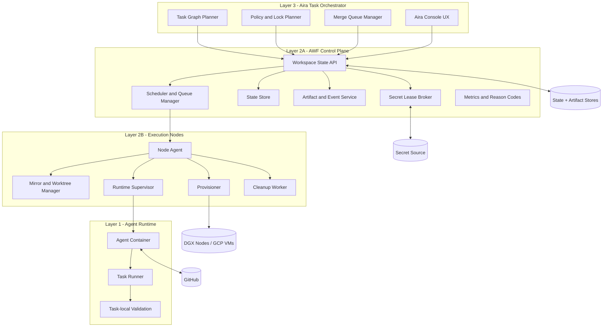

# Aira Agent Workspace Fabric (AWF) v2.2

> Historical product contract: this Aira-oriented PRD guided the current public
> Agent Workspace Fabric (AWF) alpha. Public release instructions live in
> `RELEASING.md`; current user-facing setup lives in `README.md` and
> `docs/QUICKSTART.md`.

**Combined Product Requirements Document and Architecture Specification**

| Field | Value |
| --- | --- |
| Product Name | **Aira Agent Workspace Fabric (AWF)** |
| Alternate Name | Aira Agent Workspace System |
| Document Type | Combined PRD + Architecture Specification |
| Primary Stakeholder | Dmitri |
| Author | Manus AI |
| Status | v2.2 persistent sidecar and implementation-spec revision for Phase 1 execution planning |
| Scope of This Version | **Full end-state product vision with v2.2 persistent workspace-stack and implementation clarifications** |
| Target Environments | Local DGX Spark cluster and Google Cloud Platform |
| Primary SCM Model | GitHub-hosted repositories with branch-based workflow |

## 1. Executive Summary and Product Vision

**Aira Agent Workspace Fabric (AWF)** is the execution substrate that allows Aira to treat AI agents as disciplined software contributors rather than ad hoc coding bots. Each task is executed inside an isolated, ephemeral, reproducible workspace that can receive scoped instructions, modify a repository, validate its own changes, push a branch, and report a structured result without interfering with concurrent work. This v2.2 document preserves the architectural direction of the original PRD while converting it into a more deterministic and implementation-safe product contract. It also expands the scope from an initial minimal platform toward the **complete intended end-state system**, consistent with the review feedback provided by the user.[1] [2] In this revision, workspace isolation is clarified to mean a **workspace-local service stack**, not merely a checkout and an agent container: every database-backed workspace must have its own persistent Postgres sidecar for the full workspace lifecycle, and validation-side services such as the app-under-test and Playwright must be modeled explicitly as part of the same stack.

The full product vision is that **many agents can work in parallel on the same repository with the operational discipline of a high-performing engineering organization**. In operational terms, that means Aira can decompose work into tasks, assign each task a bounded scope, dispatch it into an isolated execution environment, detect overlap before and after execution, rebase and revalidate deterministically when the target branch moves, and merge changes through a governed queue rather than through opportunistic branch handling.[1] [2]

The architectural vision remains a layered system, but Layer 2 is now explicitly split into two responsibilities. **Layer 1** is the standardized Agent Runtime. **Layer 2A** is the central control-plane orchestration service, including scheduling, state, policy enforcement, API surface, artifacts, and merge-adjacent coordination. **Layer 2B** is the execution-node plane, responsible for node-local provisioning, workspace lifecycle actions, cleanup, and runtime supervision. **Layer 3** is Aira itself, which owns planning, dependency ordering, merge intent, and operator-facing workflow policy.[1] [2]

| Design Principle | End-State Requirement |
| --- | --- |
| Isolation | Every task attempt runs in a workspace isolated by filesystem, process boundary, network policy, resource reservation, secret lease scope, and workspace-local service stack with persistent sidecars where required |
| Determinism | Task class, touched paths, repo policy, and drift state determine locking, stale marking, validation tier, and escalation behavior through explicit rules |
| Merge safety | No task result is mergeable solely because it once passed tests; merge eligibility must be evaluated against the current target-branch state |
| Portability | Layer 1 contract and Layer 3 semantics remain stable across local DGX and GCP backends |
| Operability | The system must be observable and controllable both locally and in production through explicit operator UX surfaces |
| Security | Credentials, network egress, package execution risk, and artifact exposure must be governed as first-class product requirements |

## 2. Problem Statement

Dmitri is building Aira as an orchestration platform where humans and AI agents collaborate as coordinated contributors. In that model, the central problem is no longer whether an agent can write code. The problem is whether many agents can safely work on the same codebase without collapsing into stale branches, conflicting pull requests, broken validation assumptions, duplicated effort, and manual triage overhead. The original v1 identified this correctly; the expert review then highlighted that the remaining gap was not architectural direction but insufficiently deterministic policy definition.[1] [2]

The failure mode is straightforward. Multiple agents start from different base commits, edit partially overlapping files, run tests against non-identical repository states, and finish work that is locally valid but no longer integration-safe by the time it reaches merge consideration. Some tasks also alter dependencies, build settings, or database schema, which means a passing result can become invalid even if Git can technically rebase it. Without explicit stale rules, validation tiers, locking policy, and retry semantics, the workflow becomes hard to trust and expensive to operate.[1] [2]

| Pain Point | Current Failure Mode | Required Product Response |
| --- | --- | --- |
| Parallel branch drift | A task finishes against an outdated base branch after another branch merges | Detect staleness deterministically, rebase or redispatch, and require fresh validation before merge |
| Overlapping edits | Agents touch the same files, modules, manifests, or interfaces | Apply pre-dispatch ownership and lock policy by task class, then enforce post-task scope checks |
| Untrustworthy test results | Validation occurred before target branch changed or against shared mutable services | Use explicit three-tier validation and isolated task-local services |
| Schema and dependency coupling | Migrations or dependency changes invalidate other live workspaces | Serialize high-risk work classes, mark dependent workspaces stale, and require stronger merge validation |
| Manual operator burden | Failures are hard to diagnose and actions are inconsistent | Provide operator dashboards, reason codes, timelines, failure taxonomy, and one-click remediation |
| Security risk | Agents have broad credentials and uncontrolled egress | Use short-lived leases, least privilege, egress policy modes, and artifact/log redaction boundaries |
| Backend divergence | Local and cloud execution behave differently | Keep Layer 1 and API contracts constant while backend adapters change underneath |

## 3. Product Goals, Non-Goals, and End-State Scope

The primary goal of AWF is to make concurrent AI software work **safe, reproducible, and backend-portable**. The product must let Aira dispatch many tasks in parallel against one repository while minimizing unnecessary conflicts and ensuring that any code presented for merge has been validated at the correct tier for its risk profile.

A second goal is to create a clean separation between planning and execution. Aira decides **what** work should happen, how tasks depend on one another, and what merge order is intended. AWF decides **where** and **how** that work executes, how state is tracked, and how merge safety is enforced. The system should therefore expose a control-plane contract that is stable enough for Aira to depend on regardless of whether execution happens on a single DGX host, across several DGX nodes, or on GCP.

This version specifies the **full intended end state**, not merely a stripped Phase 1 implementation. Delivery is phased, but normative behavior in this document describes the complete system unless a section explicitly marks a later-phase implementation detail.

| Category | In Scope |
| --- | --- |
| Workspace isolation | Ephemeral per-task-attempt workspaces with controlled filesystem, network, credentials, resource reservation, validation context, and persistent workspace-local service sidecars where required by repo profile |
| Git execution model | Canonical repo mirror, worktrees or equivalent cached checkouts, scoped task branches, controlled rebasing, and merge queue integration |
| Task governance | Deterministic policy matrix by task class, stale marking rules, escalation rules, validation tiers, and retry lineage |
| Operator experience | Local CLI and web dashboard, plus Aira-integrated production console with monitoring and one-click actions |
| Security model | Secret lease issuance, token lifetime policy, egress policy modes, log/artifact redaction, package-install risk controls, and isolation boundaries |
| Observability and metrics | Structured events, reason codes, artifacts, queue visibility, and enforceable reliability/throughput/quality/operations baselines |
| Backend portability | Common Layer 1 contract and common Layer 2A API with pluggable Layer 2B execution nodes on local DGX and GCP |

| Category | Explicit Non-Goals |
| --- | --- |
| Autonomous project planning replacement | AWF does not replace Aira's higher-level project decomposition, task authoring, or human governance |
| Perfect semantic merge | AWF reduces integration risk but does not guarantee automatic resolution of every semantic conflict |
| General CI replacement | AWF may invoke CI-like validation but does not replace all enterprise CI/CD concerns |
| Broad multi-tenant SaaS hardening in Phase 1 | The initial delivery targets Dmitri’s controlled environments before broader tenancy concerns |
| Arbitrary cloud portability | The planned cloud target is GCP; other providers may be added later but are not required for this contract |

## 4. Primary Users and End-State Use Cases

The direct human user is Dmitri as builder and operator, but AWF is also a product surface for Aira and a runtime contract for agent executors. The design must therefore satisfy three constituencies simultaneously: operators who need control and diagnosis, Aira as the orchestration client that needs determinism, and agent runtimes that need a predictable execution envelope.[1]

| Actor | Role | Core Need |
| --- | --- | --- |
| Dmitri | Builder, operator, debugger | Needs visibility, manual override, policy clarity, and backend portability |
| Aira Task Orchestrator | Planning and dispatch client | Needs a deterministic control-plane API and explicit state semantics |
| AI Agent Runtime | Execution worker | Needs isolated source access, secret lease scope, validation commands, and structured result reporting |
| Human reviewer | Escalation and merge authority | Needs trustworthy provenance, failure reason codes, and merge/validation explanation |

The end-state use cases include parallel feature development, task-local documentation work, targeted test-writing tasks, overlapping refactors with deterministic conflict policy, dependency update tasks, build configuration changes, database migrations, and later production operation inside Aira's console. AWF must also support the full lifecycle of stale detection, automated rebase, redispatch lineage, and post-merge confidence validation.

| Use Case | Description | Expected Outcome |
| --- | --- | --- |
| Parallel engineering delivery | Several agents work concurrently on one repository | Isolation, lock enforcement, and merge queue serialize integration safely |
| Docs-only task | Agent edits docs or examples | Advisory owned paths, low validation tier by default, fast merge gating if repo policy allows |
| Refactor task | Agent touches shared code without intended behavior change | Controlled overlap policy, stronger stale marking, elevated validation tier |
| Migration task | Agent changes schema and app code | Advisory owned-path risk, schema-aware stale invalidation, elevated validation |
| Dependency task | Agent updates package manifests or lockfiles | Advisory owned-path risk, supply-chain checks, elevated validation, operator visibility |
| Local operator workflow | Dmitri runs AWF on a DGX node | CLI plus lightweight dashboard expose queue, locks, resource usage, and retries |
| Aira production workflow | AWF becomes a production subsystem in Aira | Integrated operator console exposes same semantics with richer aggregation |

## 5. Architectural Overview

The end-state architecture is a four-part operating model expressed through three layers. Layer 1 remains the portable runtime contract. Layer 2 is split into a central control plane and node-local execution responsibilities. Layer 3 is Aira. Supporting data services store state, logs, artifacts, metrics, and secret references.



The architectural principle is unchanged from v1: **Layer 1 stays the same everywhere; execution backends differ only behind the Layer 2 contract**. What changes in v2.2 is the precision of the system boundary. The central AWF control plane owns policy-aware state, API semantics, and scheduling. Each execution node owns the concrete mechanics of workspace creation, process supervision, and cleanup. This split is required for scaling beyond a single host and for operating consistently across local and GCP backends.[1] [2]

| Layer | Responsibility | Must Not Own |
| --- | --- | --- |
| Layer 1 — Agent Runtime | Execute task instructions, run task-local validation, commit and report structured result | Global scheduling, secret brokering policy, merge decisions |
| Layer 2A — Control Plane | API, state machine, queueing, reservations, leases, artifacts, reason codes, retry lineage | Node-specific provisioning mechanics |
| Layer 2B — Execution Node | Repo materialization, container or VM-local setup, runtime supervision, cleanup, node telemetry | Product-level scheduling policy or merge policy |
| Layer 3 — Aira | Task decomposition, dependency graph, lock planning, merge intent, human-facing orchestration | Workspace implementation details |

### 5.1 Workspace Stack Contract

For the Aira dogfooding stack, a workspace is not only an agent container and a checkout. The normative unit of isolation is a **workspace-local Docker Compose project** with a persistent service envelope. At minimum, any workspace that may develop or validate database-backed code must keep a dedicated **Postgres** service alive for the full workspace lifecycle from `provisioning` through `destroying`, because Alembic migrations must execute against a database instance that is owned exclusively by that workspace. Shared databases or schema-only partitioning are not acceptable substitutes for migration-capable workspaces in the default design.

| Service in the Workspace Stack | Lifecycle Rule | Purpose |
| --- | --- | --- |
| Agent runtime container | Runs for the active workspace lifecycle, subject to pause or restart policy | Hosts OpenClaw and task execution |
| Postgres sidecar | **Persistent for the full workspace lifecycle** whenever the repository profile requires a database | Workspace-local migration target and application state store for validation |
| Redis sidecar | Optional and profile-driven; persistent when the application under development requires it | Cache, queue, or pub-sub dependency for the app under development |
| App-under-test container | May be started only during validation or explicit debugging windows | Runs the branch under test against the workspace-local services |
| Playwright container | May be started only during validation or explicit debugging windows | Executes browser-driven end-to-end suites inside the workspace network |

When a task is classified as `migration_task` or otherwise marked schema-dependent, the workspace must apply its own Alembic migrations to its own Postgres instance. If another migration merges first, the affected workspace must reconstruct database state from the new target-branch baseline and then reapply its own migration sequence before it may claim fresh validation again.

## 6. Deterministic Policy Matrix by Task Class

The system must replace narrative flexibility with deterministic policy selection. Every task attempt is assigned a **task class** before dispatch. Task class may be explicitly set by Aira, inferred from requested scope, or upgraded by touched-path analysis. The task class determines overlap-risk metadata, stale marking triggers, default validation tier, and escalation path. If actual touched files imply a higher-risk class than initially declared, the system must upgrade the class and apply the stricter validation and stale policy.

Owned paths are coordination hints and stale-detection inputs, not exclusive code locks. A path overlap between active workspaces must not block admission by itself, including for `migration_task`, `dependency_task`, and `build_config_task`. Blocking is reserved for a future explicit exclusive resource lock concept that is scoped separately from owned paths.

| Task Class | Default Examples | Admission and Overlap Behavior | Stale Marking Rules | Validation Level | Escalation Behavior |
| --- | --- | --- | --- | --- | --- |
| `docs_task` | Markdown docs, comments-only edits, examples outside executed build path | Admit owned-path overlaps; attach `OWNED_PATH_OVERLAP_RISK` warning when active workspaces overlap | Mark stale only if target branch advances on overlapping owned paths or docs build config changes | **Tier 1** by default; Tier 2 if docs site build or code examples are executable | Escalate only on out-of-scope edits, repeated docs build failure, or merge conflict |
| `test_task` | Adding or updating tests without intended production code changes | Admit owned-path overlaps; shared fixtures or harness config may require stricter validation but not path-based admission failure | Mark stale if target branch advances on touched production paths, shared test harness, fixtures, or owned test paths | **Tier 1 + targeted Tier 2** by default | Escalate on out-of-scope production edits, flaky validation beyond retry budget, or merge conflict |
| `refactor_task` | Internal restructuring, renames, code movement without intended behavior change | Admit owned-path overlaps; surface overlapping module/interface/codegen paths as risk metadata | Mark stale if target branch advances on any overlapping module path, interface surface, dependency manifest, or build config | **Tier 2** minimum | Escalate on semantic overlap, repeated rebase failure, validation mismatch, or unexpected scope expansion |
| `migration_task` | Schema migrations, data model contract changes, stateful rollout scripts | Admit owned-path overlaps and flag risk; serialize only if a future explicit exclusive schema resource lock exists | Mark stale immediately on any target-branch schema, migration, ORM model, or dependency change affecting runtime contract; affected workspaces must refresh database state before further validation | **Tier 2** mandatory; **Tier 3** recommended or mandatory per repo policy | Escalate on any rebase conflict, failed migration validation, cross-task schema contention, or required database refresh after upstream merge |
| `dependency_task` | Package manifest changes, lockfile updates, base image updates, toolchain changes | Admit owned-path overlaps and flag risk; serialize only if a future explicit exclusive dependency/toolchain resource lock exists | Mark stale on any target-branch change to manifests, lockfiles, generated dependency artifacts, or build tooling | **Tier 2** mandatory; Tier 3 if runtime-critical or security-sensitive dependency change | Escalate on install-script policy violation, CVE or policy failure, repeated flake, or merge conflict |
| `build_config_task` | CI config, Dockerfiles, Makefiles, build scripts, codegen config | Admit owned-path overlaps and flag risk; serialize only if a future explicit exclusive build resource lock exists | Mark stale on any target-branch change to build config, generated artifacts, runtime image config, or toolchain manifests | **Tier 2** mandatory; Tier 3 if repo policy marks build system as critical | Escalate on any rebase conflict, validation failure affecting shared build path, or unexpected downstream blast radius |

The default task-class assignment itself must be deterministic.

| Rule Order | Condition | Result |
| --- | --- | --- |
| 1 | Explicit task class provided by Aira and consistent with requested owned paths | Use explicit class |
| 2 | Requested owned paths include migration, schema, or DB contract surfaces | Assign `migration_task` |
| 3 | Requested owned paths include dependency manifests, lockfiles, or runtime image definitions | Assign `dependency_task` |
| 4 | Requested owned paths include build scripts, CI config, codegen config, or shared toolchain settings | Assign `build_config_task` |
| 5 | Requested scope is test-only | Assign `test_task` |
| 6 | Requested scope is docs-only | Assign `docs_task` |
| 7 | All other code changes | Assign `refactor_task` unless Aira sets a future dedicated feature-task class |

### 6.1 Normative Conflict Resolution Order

When multiple policy sources disagree, AWF must resolve them in a single normative order rather than by section-local interpretation. Lower layers may not weaken stronger ones; they may only strengthen, serialize, or further restrict behavior.

| Order | Policy Layer | Effect |
| --- | --- | --- |
| 1 | Security policies | Secret scope, egress mode, forbidden actions, and artifact handling rules always win |
| 2 | Repository policy | Path-based and class-based repository rules may strengthen defaults for the specific repo |
| 3 | Task-class policy | The task-class matrix defines overlap-risk behavior, stale behavior, and validation floor |
| 4 | Touched-path upgrades | If actual touched paths imply a higher-risk class, AWF upgrades to the stricter class immediately |
| 5 | Stale and freshness rules | Fresh-validation and drift rules may block merge eligibility even after earlier checks passed |
| 6 | Merge queue ordering rules | Serialized integration and queue ordering decide when an otherwise eligible candidate may merge |
| 7 | Operator overrides | Humans may reprioritize, pin, or make canonical only within all stronger constraints above |

| Example Conflict | Winning Rule | Required Outcome |
| --- | --- | --- |
| Repository policy attempts to allow Tier 1 only for a path that is classified as `migration_task` | Task-class policy | The attempt still requires Tier 2, and Tier 3 if repo policy strengthens it |
| Operator tries to make a stale attempt canonical without fresh required validation | Stale and freshness rules | Override is rejected until the attempt is refreshed or replaced |

## 7. Scheduling, Advisory Ownership, and Fairness Policy

A scheduler that can create workspaces but cannot explain its admission and ordering decisions will not be operationally trustworthy. AWF therefore must schedule at the **task-attempt** level, not merely at the task level, and it must account for queue priority, starvation prevention, overlap risk, resource saturation, and retry budgets.[2]

Admission happens in two stages. First, AWF evaluates policy, owned-path hints, existing active overlap, and resource requirements. An attempt may enter `queued` or be provisioned when its policy class is known and required resource reservation has been computed. Owned-path overlap never blocks admission by itself; the new attempt carries an overlap risk marker and stricter stale checks. A future explicit exclusive resource lock may block admission, but that lock must be modeled separately from owned paths. Appendix A defines the normative advisory owned-path semantics, overlap resolution, lifecycle, and retry behavior.

### 7.1 Scheduling Order and Fairness

The scheduler must compute a concrete dispatch score for every runnable attempt inside the same resource class and eligible node pool.

> **Effective dispatch score** = `task.priority + class_bias + age_boost + retry_bonus + human_boost`

The score is then applied in lexicographic order as `(class_priority, effective_dispatch_score, queued_at)` where higher `class_priority` wins, higher `effective_dispatch_score` wins, and earlier `queued_at` wins the final tie.

| Component | Rule | Default Value |
| --- | --- | --- |
| `task.priority` | Base priority supplied by Aira on a normalized 0-100 scale | Repository-specific input |
| `class_priority` | Scheduling bucket for serialized or higher-risk work | `migration_task=5`, `dependency_task=4`, `build_config_task=3`, `refactor_task=2`, `test_task=1`, `docs_task=0` |
| `class_bias` | Fixed bias added to the effective dispatch score | `migration=15`, `dependency=12`, `build_config=10`, `refactor=4`, `test=2`, `docs=0` |
| `age_boost` | Queue aging factor to prevent starvation | `min(floor(wait_minutes / 15), 12)` |
| `retry_bonus` | Small boost for retries caused by infrastructure failure only | `+3` if parent attempt failed with `infrastructure_failure`, otherwise `0` |
| `human_boost` | Explicit operator boost bounded by repo policy | `0` by default, maximum `+5` |

### 7.2 Starvation and Retry Placement

Fairness must be enforceable rather than aspirational. Any runnable attempt that waits more than **120 minutes** must be bumped ahead of newer runnable attempts in the same resource class, unless it asks for resources that are not currently satisfiable or is blocked by a future explicit exclusive resource lock. This rule does not convert owned-path overlap into serialization for `migration_task`, `dependency_task`, or `build_config_task`; it only changes relative order among attempts that are otherwise admissible.

Retries share the same queue as first-run attempts. They do not inherit lock ownership from their parent attempt, and they receive a retry bonus only when the prior failure class was `infrastructure_failure`. This bonus is intentionally too small to let retries permanently outrank new work with materially higher base priority. Running attempts are not preempted by default, but queued and not-yet-started attempts may be reprioritized or cancelled and requeued.

| Policy Area | Requirement |
| --- | --- |
| Scheduling unit | The unit of dispatch is `task_attempt`, each with its own lineage, reservation, validation history, and failure reason codes |
| Owned-path overlap handling | Overlapping owned paths permit admission and require an overlap risk marker plus stale invalidation if another attempt changes the overlapping region |
| Future exclusive-lock handling | Only an explicit exclusive resource lock may block admission and place the attempt in `blocked_on_lock`; owned paths are not that lock |
| Fairness guarantee | No runnable attempt may wait indefinitely behind newer runnable attempts in the same resource class |
| Cancellation | Cancellation may be requested in any non-terminal state; node execution should stop quickly but cleanup may continue asynchronously |
| Preemption | Running attempts are not preempted by default; queued attempts may be reprioritized; reserved but not started attempts may be cancelled and requeued |
| Max runtime | Repo policy must define default runtime budget by task class; attempts exceeding budget transition to timeout handling rather than running indefinitely |

### 7.3 Resource Reservation Model for Persistent Workspace Stacks

Resource admission must distinguish between **steady-state reservation** and **test-burst reservation**. For the local Phase 1 profile, AWF must reserve enough capacity to keep the agent runtime and persistent data sidecars alive while also accounting for the temporary increase when the app-under-test and Playwright services are brought up.

| Service | Default Reservation | Lifecycle Role |
| --- | --- | --- |
| Agent runtime | 2 CPU / 8 GB RAM | Steady-state workspace execution |
| Postgres | 1 CPU / 2 GB RAM | Steady-state persistent sidecar for the full workspace lifecycle |
| Playwright | 2 CPU / 4 GB RAM | Test-burst only during E2E validation |
| App-under-test | 1 CPU / 2 GB RAM | Test-burst only during validation or debug windows |
| Redis (optional) | Repository-profile-specific additional reservation | Persistent only when the application requires it |
| Peak baseline without optional Redis | **~6 CPU / ~16 GB RAM** | Full validation stack for one workspace |
| Steady-state without test containers | **~3 CPU / ~10 GB RAM** | Coding or idle periods with agent + Postgres alive |

On a single **DGX Spark** with **20 CPU cores and 128 GB RAM**, this resource model supports **2-3 concurrent full workspace stacks comfortably** while leaving room for the control plane, node agent, filesystem cache, and operator headroom. On a **4-node DGX Spark cluster**, the same model scales to roughly **8-12 concurrent full agents**, assuming similar per-node capacity and conservative placement. The scheduler must therefore admit test-burst workloads against **peak reservation**, not just steady-state reservation, while allowing app-under-test and Playwright containers to remain stopped during coding periods to conserve capacity.

## 8. State Model, Retry Semantics, and Idempotency

The workspace system must model **task**, **task attempt**, **workspace**, and **operation** as distinct but related lifecycle objects. A task may produce multiple attempts through retry, redispatch, or supersession. A workspace hosts at most one active task attempt. An operation records the lifecycle of an asynchronous action such as refresh, rebase, validate, cancel, or destroy. A task attempt may be superseded by a later attempt while still retaining historical lineage.

### 8.1 Canonical State Definitions

| Object | State | Meaning | Terminal |
| --- | --- | --- | --- |
| `workspace` | `requested` | API accepted request but provisioning not yet begun | No |
| `workspace` | `provisioning` | Node assigned and environment creation in progress | No |
| `workspace` | `ready` | Workspace provisioned and waiting to start attempt | No |
| `workspace` | `running` | Agent runtime actively executing task logic | No |
| `workspace` | `validating_tier1` | Task-local validation is running inside workspace | No |
| `workspace` | `pushing` | Branch push and artifact finalization are running | No |
| `workspace` | `completed` | Attempt completed and branch/result recorded | Yes |
| `workspace` | `stale` | Workspace result invalidated by branch drift or policy trigger | No |
| `workspace` | `rebasing` | Automated rebase is in progress | No |
| `workspace` | `validating_tier2` | Merge-candidate validation after rebase or freshening is running | No |
| `workspace` | `validating_tier3` | Optional post-merge confidence validation is running | No |
| `workspace` | `failed` | Attempt failed due to runtime, policy, validation, merge, or infrastructure reason | Yes |
| `workspace` | `cancelled` | Attempt or workspace was cancelled intentionally | Yes |
| `workspace` | `destroying` | Cleanup in progress after terminal or explicit destroy request | No |
| `workspace` | `destroyed` | Workspace resources reclaimed and state archived | Yes |
| `task_attempt` | `queued` | Awaiting dispatch | No |
| `task_attempt` | `blocked_on_lock` | Admission blocked by a future explicit exclusive resource lock | No |
| `task_attempt` | `in_progress` | Bound to active workspace | No |
| `task_attempt` | `superseded` | Replaced by newer canonical attempt before merge | Yes |
| `task_attempt` | `merged` | This attempt became the merge source | Yes |
| `task_attempt` | `abandoned` | No longer eligible due to redispatch, stale dead-end, or policy | Yes |
| `operation` | `PENDING` | Request accepted but not yet started | No |
| `operation` | `RUNNING` | Async action is in progress | No |
| `operation` | `SUCCEEDED` | Async action completed successfully | Yes |
| `operation` | `FAILED` | Async action completed unsuccessfully | Yes |
| `operation` | `CANCELLED` | Async action was cancelled before completion | Yes |

### 8.2 Canonical Attempt Selection

A task may have **at most one** `task_attempt` with `is_canonical_for_merge = true` at any moment. A task may also temporarily have **zero** canonical attempts during abandonment or redispatch. Canonical status identifies the attempt that represents the task's current best merge path, but canonical status alone does not make an attempt merge-eligible.

A canonical attempt is **merge-eligible** only when all of the following are true: the attempt is `completed`, not stale, not blocked by unresolved policy or lock failure, and holds the required fresh validation tier relative to the current target SHA.

| Event | Canonical Rule |
| --- | --- |
| First completed attempt for a task reaches required fresh validation | It becomes canonical automatically |
| Newer attempt for the same task reaches completed with required fresh validation | It becomes canonical automatically and the prior canonical attempt becomes `superseded` |
| Canonical attempt becomes stale but can be refreshed by rebase | It may remain canonical while non-merge-eligible during refresh and Tier 2 revalidation |
| Canonical attempt becomes stale and policy requires redispatch instead of rebase | It must transition to `abandoned` before a new attempt is created |
| Operator uses `make canonical` | Allowed only for a completed attempt that satisfies mandatory validation and freshness rules; previous canonical becomes `superseded` |

A `merge_candidate` must always reference the canonical attempt. If canonical status changes, AWF must close the old merge candidate with reason `CANONICAL_CHANGED` and create a new candidate record for the new canonical attempt. A merge candidate is invalidated by canonical change, new stale reason, fresh policy failure, mandatory validation-tier upgrade, or target-branch advancement that invalidates freshness.

### 8.3 Allowed Workspace State Transitions

The system must reject any transition not explicitly allowed below.

| From State | Allowed To State(s) | Trigger |
| --- | --- | --- |
| `requested` | `provisioning`, `cancelled` | Scheduler begins provisioning or request is cancelled before provisioning |
| `provisioning` | `ready`, `failed`, `cancelled` | Provision succeeded, irrecoverable provision failure, or cancellation |
| `ready` | `running`, `cancelled`, `destroying` | Start accepted, cancelled before start, or explicit destroy |
| `running` | `validating_tier1`, `failed`, `cancelled` | Runtime exits and validation starts; runtime error; cancellation |
| `validating_tier1` | `pushing`, `failed`, `cancelled` | Tier 1 success; validation failure; cancellation |
| `pushing` | `completed`, `failed`, `cancelled` | Push or result finalization succeeds; push fails; cancellation |
| `completed` | `stale`, `rebasing`, `destroying` | Drift detected, explicit refresh, or destroy |
| `stale` | `rebasing`, `failed`, `cancelled`, `destroying` | Rebase starts; policy declares dead-end; operator cancels; destroy |
| `rebasing` | `validating_tier2`, `failed`, `cancelled` | Rebase succeeded and merge-candidate validation starts; rebase failed; cancellation |
| `validating_tier2` | `completed`, `stale`, `failed`, `cancelled` | Validation freshened candidate; new drift occurs during validation; validation fails; cancellation |
| `validating_tier3` | `completed`, `failed` | Post-merge confidence validation succeeded or failed |
| `failed` | `destroying` | Cleanup initiated |
| `cancelled` | `destroying` | Cleanup initiated |
| `destroying` | `destroyed`, `failed` | Cleanup succeeds or cleanup fails |

### 8.4 Retry Semantics by State

Retries are defined at the **task-attempt lineage** level, not by mutating history in place. A retry creates a new `task_attempt` record linked to its parent attempt unless the operation is explicitly idempotent and still in flight. Lock claims are always recomputed from current policy and current repository state; retries never inherit lock ownership automatically.

| State Encountered | Default Retry Semantics |
| --- | --- |
| `requested` / `provisioning` | Safe to retry create only via the same idempotency key; otherwise create a new attempt after terminal failure |
| `ready` | Start may be retried idempotently if not yet launched; duplicate start calls must not launch multiple runtimes |
| `running` | No blind retry; operator may cancel and create new attempt, preserving lineage |
| `validating_tier1` / `validating_tier2` | Validation may be retried within configured retry budget if failure reason is flaky or infrastructure-related; deterministic test failures require no automatic retry |
| `pushing` | Push may be retried idempotently if remote branch state proves no duplicate divergent push occurred |
| `completed` | No retry of execution; only refresh, rebase, or validate actions |
| `stale` | Recovery path is `rebase` if policy permits, otherwise redispatch a new attempt |
| `rebasing` | Rebase may be retried only for transient git or infrastructure failure; content conflicts are non-retriable and require escalation or redispatch |
| `failed` | Automatic retry allowed only if failure taxonomy marks the cause retriable and retry budget remains |
| `destroying` | Cleanup retries may continue until cleanup budget is exhausted; workspace remains non-reusable |

### 8.5 API Idempotency Guarantees

All mutating API calls must accept an `Idempotency-Key` header. The server must return the original accepted result for duplicate keys within the retention window unless the payload differs, in which case it must return an idempotency conflict error.

| Endpoint | Idempotent Behavior |
| --- | --- |
| `POST /v1/workspaces` | Same key and same payload returns the same workspace request object; no duplicate workspace may be created |
| `POST /v1/workspaces/{id}/start` | Same key must not launch more than one runtime; returns the same operation status |
| `POST /v1/workspaces/{id}/refresh` | Same key recomputes drift only once for the same requested target and returns the same operation record |
| `POST /v1/workspaces/{id}/rebase` | Same key for the same target revision returns the same rebase operation; no second concurrent rebase is created |
| `POST /v1/workspaces/{id}/validate` | Same key for the same validation request returns the same validation operation record |
| `POST /v1/workspaces/{id}/cancel` | Repeated calls are safe and return current cancellation status |
| `DELETE /v1/workspaces/{id}` | Repeated destroy requests are safe; if already destroyed, return the terminal state rather than error |

## 9. Validation Tiers and Merge Safety Model

Validation is a three-tier model. A passing result in one tier must never be misrepresented as satisfying a stronger tier. The chosen tier is determined by **task class, touched paths, repo policy, and historical flakiness**. Repository policy may promote the required tier upward but may not lower a mandatory tier defined by task class.

| Tier | Name | Purpose | Execution Point |
| --- | --- | --- | --- |
| Tier 1 | Task-local validation | Proves the task attempt is locally coherent inside its workspace | During initial task execution in the workspace |
| Tier 2 | Merge-candidate validation | Proves the branch remains valid after rebase onto the latest target branch | After refresh and rebase, or immediately before merge eligibility |
| Tier 3 | Post-merge confidence validation | Detects residual integration risk on the target branch after merge | On the target branch after merge or on an exact post-merge simulation |

Tier 2 must be split into **targeted Tier 2** and **full Tier 2** so that AWF can be economically strict without becoming computationally wasteful.

| Decision Condition | Tier 2 Mode | Required Behavior |
| --- | --- | --- |
| Touched paths remain localized, affected suites are shardable, and no public interface, schema, dependency, build, or codegen surface changed | Targeted Tier 2 | Run only the repository-declared impacted subset and record the suite-selection basis |
| Any `migration_task`, `dependency_task`, or `build_config_task` | Full Tier 2 | Run the full mandatory merge-candidate suite |
| Refactor changes touch a public interface, shared contract, codegen output, or repository-marked high-blast-radius path | Full Tier 2 | Do not rely on targeted selection |
| Repository cannot prove impacted-suite mapping deterministically | Full Tier 2 | Fall back to the full suite rather than optimistic targeting |
| Freshness invalidation was triggered by schema, dependency, or build drift | Full Tier 2 | Revalidate the fully refreshed candidate |

Flakiness handling must also be explicit because reruns have real cost and weak rerun rules create false confidence.

| Historical Suite Signal | Required Behavior | Recording Requirement |
| --- | --- | --- |
| Flakiness rate `<= 2%` over the rolling repository-defined window | One passing run is sufficient | `validation_run.is_flaky_suite = false` |
| Flakiness rate `> 2%` and `<= 5%` | Require either two passing runs on the same reproducibility identity or one pass plus human review | `validation_run.is_flaky_suite = true` and store the observed flakiness rate |
| Flakiness rate `> 5%` | Treat the suite as unstable; require human review and optionally Tier 3 follow-up before merge | `validation_run.is_flaky_suite = true` and reason code must identify flaky gating |

> **Reproducibility** means the same pass or fail outcome and the same primary reason code on rerun. It does **not** require byte-identical logs or artifacts.

The reproducibility identity tuple is **`(repo_sha, env_profile_version, validation_command_set_hash)`**. A validation result may be considered reproducible only within the same tuple and within repository-defined flake tolerance.

| Decision Input | Rule |
| --- | --- |
| Task class | `migration_task`, `dependency_task`, and `build_config_task` require at least full Tier 2; Tier 3 is recommended or mandatory by repository policy |
| Touched paths | Paths in schema, dependency, build, public interface, codegen, or shared config surfaces promote validation at least to full Tier 2 |
| Repository policy | A repository may declare stricter path-based or class-based validation rules |
| Historical flakiness | If touched validation suites exceed the flakiness threshold, the system may require rerun quorum, human review, or Tier 3 follow-up |
| Merge queue position | Any candidate whose target branch advanced since last fresh validation must regain fresh Tier 2 status before merge |

## 10. Failure Taxonomy and Handling Paths

Failure handling must be category-specific. A single generic `failed` state is insufficient for operators or automation. Every failed attempt, failed workspace action, and failed validation run must carry a primary failure taxonomy code plus a human-readable reason.

| Failure Class | Definition | Typical Examples | Default Handling Path |
| --- | --- | --- | --- |
| `infrastructure_failure` | Failure in provisioning, node health, storage, network, container runtime, or control-plane dependency | Container create failure, node disk full, artifact store outage | Automatic retry within infra budget, then node quarantine or redispatch |
| `agent_failure` | Runtime did not complete task due to agent crash, timeout, malformed output, or execution error | Agent process crash, invalid result schema, runtime exceeded budget | Retry only if configured; otherwise surface to operator or redispatch |
| `policy_failure` | Attempt violated declared scope or policy | Out-of-scope file edits, unauthorized network call, forbidden package install | No automatic retry on same spec; escalate or redispatch with revised scope |
| `validation_failure` | Validation conclusively failed | Tests failed, linter failed, migration check failed | No blind retry unless suite marked flaky; candidate blocked |
| `merge_failure` | Candidate could not be rebased or merged safely | Rebase conflict, merge queue policy rejection | Escalate, supersede, or redispatch depending on task class |
| `cleanup_failure` | Workspace resources could not be reclaimed fully | Stuck container, orphaned volume, leaked secret lease revoke failure | Retry cleanup asynchronously; pin workspace if needed |

This taxonomy must surface directly in operator tooling, metrics, events, and API responses. A failure without a taxonomy code is itself a product defect.

## 11. Security Model and Threat Analysis

Security in AWF is not limited to keeping secrets hidden from logs. The threat model must assume that agent instructions, repository contents, dependency scripts, external packages, and generated outputs can all become attack vectors. The system therefore needs explicit credential issuance patterns, isolation boundaries, egress policy modes, and artifact exposure controls.[2]

### 11.1 Credential Issuance and Least Privilege

Credentials must be issued as **secret leases** bound to workspace identity, task attempt identity, scope, and expiry. Whenever possible, AWF should use delegated, short-lived credentials rather than broad, long-lived static tokens. Secrets must be injected only into the runtime that needs them, and revocation must begin as soon as the attempt reaches terminal execution status.

| Credential Type | Preferred Pattern | Requirement |
| --- | --- | --- |
| GitHub repository access | Short-lived delegated token or installation token scoped to one repo and required operations | Default; long-lived PATs are a fallback only for early local phases |
| Cloud/resource access | Node identity or workload identity with least-privilege delegation | Must not be embedded directly in task specs |
| Third-party API secrets | Secret lease resolved from named env profile at runtime | Secret values must not be persisted in plain event payloads or logs |
| Local development fallback | Operator-provided local secret reference | Allowed only in Phase 1 local mode with explicit operator acknowledgement |

The GitHub token policy must distinguish token lifetimes.

| Token Mode | Allowed Usage |
| --- | --- |
| Short-lived token | Default for branch fetch, push, and PR-adjacent operations in controlled production mode |
| Long-lived token | Transitional local-only fallback for Phase 1 if delegated issuance is unavailable; must be scoped to least-privilege repo access and rotated on operator-managed cadence |
| Delegated credential | Preferred end-state for production Aira deployment; issued just-in-time for one workspace or one merge action |

Credential rotation must also be explicit rather than implied.

| Credential Class | Rotation / Revocation Requirement |
| --- | --- |
| Secret lease | Expires automatically at or before workspace termination and must be revoked when attempt becomes terminal |
| Short-lived GitHub token | Issued per workspace or merge action and never reused across unrelated attempts |
| Long-lived fallback token | Allowed only during early local phases; must have documented owner, rotation interval, and emergency revoke path |
| Environment profile reference | Versioned so that new attempts consume updated secret references without mutating historical attempt provenance |

### 11.2 Threat Vectors and Mitigations

| Threat Vector | Risk | Required Mitigation |
| --- | --- | --- |
| Prompt-injected exfiltration | Repository content or instructions induce agent to leak secrets or internal data | Least-privilege secret leases, egress restrictions, artifact/log scanning, and policy controls on outbound destinations |
| Malicious package install scripts | Dependency installation runs arbitrary code during setup | Support mirrored/offline dependency mode, allowlisted registries, install-script policy, and elevated validation for dependency tasks |
| Agent-generated exfiltration through logs/artifacts | Sensitive data ends up in stdout, reports, or uploaded artifacts | Structured log redaction, artifact classification, secret pattern scanning, and operator-visible reason codes |
| Lateral movement between workspaces | One compromised workspace reaches another’s resources | Per-workspace network boundary, separate secret leases, isolated storage paths, and node-agent enforcement |
| Over-broad GitHub permissions | Token grants more repos or actions than needed | Per-repo scoped delegated credentials and merge actions isolated from task credentials |
| Supply-chain dependency risk | External runtime dependencies introduce malicious or compromised code | Allowlisted registries, checksum enforcement where supported, mirrored dependency mode, and repo policy escalation |

### 11.3 Outbound Network Policy Modes

The system must support explicit egress modes because local development, controlled production, and high-security environments have different acceptable tradeoffs.[2]

| Mode | Description | Default Use |
| --- | --- | --- |
| `open_egress` | Workspace may access the public internet subject to baseline audit logging | Transitional local development only |
| `allowlisted_egress` | Workspace may access only approved destinations such as GitHub, package registries, artifact store, and named APIs | Preferred production default |
| `mirrored_offline` | Workspace has no public egress; dependencies and mirrors come from internal cache or mirror only | High-security repos, sensitive production work, or dependency task hardening |

Repo policy must define which modes are permitted by task class. `dependency_task` and `build_config_task` may be forced into `allowlisted_egress` or `mirrored_offline` for selected repositories.

## 12. Operator Experience

Operator UX is a first-class product surface, not an implementation afterthought. Dmitri must be able to monitor the system locally during development and later inside Aira production. The local experience should consist of a CLI plus a lightweight web dashboard. The production experience should expose the same core concepts inside the Aira console, with richer aggregation, multi-repo views, and role-aware controls.[2]

### 12.1 Required Screens and Views

| Screen / View | Purpose | Minimum Required Data |
| --- | --- | --- |
| Workspace timeline | Show full lifecycle for one workspace or attempt | State transitions, timestamps, node placement, validation runs, stale reason, failure reason code, human actions |
| Overlap graph | Explain current advisory owned paths and overlap relationships | Path globs, overlap risk, owning workspace or attempt, stale impact |
| Merge queue visualization | Explain why each candidate is or is not mergeable | Queue order, required validation tier, freshness state, stale dependencies, merge blocker reason |
| Resource saturation dashboard | Show capacity bottlenecks | Node CPU, memory, disk, reservation headroom, queued attempts, admission denials |
| Failure analysis view | Group failures by taxonomy and reason code | Failure class, count, retry outcome, impacted repos/nodes, latest examples |
| Validation provenance view | Show what passed, when, where, and against which base commit | Validation tier, commands, suite versions, base SHA, result freshness |

### 12.2 Filters, Reason Codes, and Actions

The UI and CLI must expose filters by repository, branch target, task class, workspace state, failure taxonomy, stale reason, node, queue status, queue decision, operator-pinned status, and canonical attempt status. Every error or blocked condition must present an actionable reason code. Free-text logs are supplementary; they are not an acceptable substitute for reason codes.

| One-Click Action | Behavior |
| --- | --- |
| `retry in same workspace` | Allowed only when policy and state allow safe retry without reprovisioning, typically validation or transient push failure |
| `refresh now` | Initiates immediate drift recomputation against the current target branch and records an async operation |
| `rebase now` | Initiates immediate rebase against the current target branch and schedules required Tier 2 validation |
| `make canonical` | Promotes a completed eligible attempt to canonical if it satisfies freshness and mandatory validation rules; automatically demotes the prior canonical attempt |
| `promote to exclusive lock` | Future operator action that converts a named resource, not an ordinary owned path, into an explicit exclusive lock and records a `human_action` event |
| `pin failed workspace` | Prevents automatic destruction for diagnosis while preserving cleanup safeguards for secrets |
| `redispatch as new attempt` | Creates a new task attempt with lineage link to failed or superseded attempt |
| `cancel and destroy` | Moves attempt toward terminal cancellation and begins cleanup |

### 12.3 Local and Production Modes

| Environment | Operator Surface | Required Behavior |
| --- | --- | --- |
| Local development | CLI plus simple web dashboard | Single-repo first, single-node visibility, same reason codes and actions as production where feasible |
| Aira production | Integrated Aira console | Multi-repo, multi-node, historical trends, role-based access, merge queue explanation, and direct linkage to planning objects |

## 13. Data Model

The data model must distinguish planning intent, execution history, validation history, security leases, queueing decisions, and operator actions. In particular, **task** and **task attempt** must be separate entities so that retries, supersession, and canonical merge choice are explicit rather than implicit.[2]

| Entity | Purpose | Key Fields |
| --- | --- | --- |
| `task` | Logical unit of planned work from Aira | `task_id`, `repo_id`, `title`, `description`, `task_class`, `owned_paths`, `priority`, `created_at` |
| `task_attempt` | One execution lineage node for a task | `attempt_id`, `task_id`, `parent_attempt_id`, `redispatch_from_attempt_id`, `status`, `superseded_by_attempt_id`, `is_canonical_for_merge` |
| `workspace` | Isolated environment bound to at most one active attempt | `workspace_id`, `attempt_id`, `backend`, `node_id`, `state`, `base_commit`, `branch_name`, `env_profile_version`, `service_profile`, `compose_project_name`, `db_refresh_generation` |
| `operation` | Async control-plane action record | `operation_id`, `type`, `workspace_id`, `attempt_id`, `status`, `error_code`, `requested_by`, `created_at`, `started_at`, `finished_at` |
| `workspace_event` | Immutable state and lifecycle event log | `event_id`, `workspace_id`, `attempt_id`, `event_type`, `old_state`, `new_state`, `reason_code`, `occurred_at` |
| `validation_run` | One validation execution at a specific tier | `validation_run_id`, `attempt_id`, `workspace_id`, `tier`, `command_set_hash`, `base_commit`, `status`, `reason_code`, `is_flaky_suite`, `reproducibility_key`, `started_at`, `finished_at` |
| `secret_lease` | Runtime-issued credential lease | `lease_id`, `workspace_id`, `attempt_id`, `secret_ref`, `scope`, `issued_at`, `expires_at`, `revoked_at` |
| `resource_reservation` | Reserved execution capacity for a task attempt | `reservation_id`, `attempt_id`, `node_id`, `steady_cpu_units`, `steady_memory_mb`, `peak_cpu_units`, `peak_memory_mb`, `disk_mb`, `reservation_phase`, `reserved_at`, `released_at` |
| `stale_reason` | Structured stale causality record | `stale_reason_id`, `workspace_id`, `attempt_id`, `trigger_type`, `trigger_ref`, `explanation`, `detected_at` |
| `queue_decision` | Snapshot of scheduler admission or blocking logic | `queue_decision_id`, `attempt_id`, `decision`, `reason_code`, `class_priority`, `computed_priority`, `age_boost`, `retry_bonus`, `decided_at` |
| `policy_evaluation_snapshot` | Immutable record of the policy inputs that produced classification and validation outcomes | `snapshot_id`, `task_id`, `attempt_id`, `task_class`, `owned_paths_resolved`, `overlap_risk_hash`, `validation_tier_required`, `repo_policy_version`, `stale_policy_version`, `created_at` |
| `human_action` | Operator intervention record | `action_id`, `actor_id`, `target_type`, `target_id`, `action_type`, `notes`, `created_at` |
| `file_lock` | Claimed ownership or exclusion surface | `lock_id`, `repo_id`, `path_glob`, `mode`, `owner_attempt_id`, `promoted_by_action_id`, `expires_at` |
| `merge_candidate` | Candidate branch and queue state | `candidate_id`, `attempt_id`, `head_sha`, `target_branch`, `queue_position`, `fresh_validation_tier`, `merge_state`, `invalidated_reason_code` |
| `env_profile` | Named environment definition without raw secret values | `env_profile_id`, `version`, `name`, `secret_refs`, `non_secret_vars`, `egress_mode` |

The canonical merge source must be explicit. If multiple attempts exist for one task, exactly one attempt may be marked `is_canonical_for_merge = true`, and only while it remains eligible. Once another attempt supersedes it, that prior attempt must transition to `superseded` or `abandoned`.

## 14. API Contract

The AWF API must behave like a real control-plane contract, not a conceptual list of endpoints. Every mutating endpoint must define idempotency, optimistic concurrency behavior, asynchronous semantics, error taxonomy, and status observation patterns.[2]

### 14.1 Common API Rules

| Concern | Requirement |
| --- | --- |
| Versioning | All endpoints are namespaced under `/v1` |
| Idempotency | Mutating requests require `Idempotency-Key` |
| Optimistic concurrency | Update-like actions accept `If-Match` or request `version` fields where appropriate |
| Pagination | List endpoints return `items`, `next_cursor`, and `has_more` |
| Time model | Timestamps are UTC ISO 8601 |
| Async semantics | Long-running actions return `202 Accepted` with an operation status object; short operations may return `200` or `201` |
| Eventing | Every state change emits a `workspace_event`; operation lifecycle changes may also emit `operation.state_changed` events |

### 14.2 Core Endpoint Summary

| Endpoint | Method | Sync vs Async | Contract Summary |
| --- | --- | --- | --- |
| `/v1/workspaces` | `POST` | Usually async | Accepts workspace request and returns an accepted request object or ready workspace if provisioning finishes within the request timeout budget |
| `/v1/workspaces/{id}` | `GET` | Sync | Returns current workspace state, version, placement, and active attempt linkage |
| `/v1/workspaces` | `GET` | Sync | Lists workspaces with pagination and filters |
| `/v1/workspaces/{id}/start` | `POST` | Async | Starts execution for the bound attempt if the workspace is `ready` |
| `/v1/workspaces/{id}/refresh` | `POST` | Async | Fetches remote refs, recomputes drift, and may emit a stale reason without mutating branch content |
| `/v1/workspaces/{id}/rebase` | `POST` | Async | Rebases the workspace branch against a target branch or SHA |
| `/v1/workspaces/{id}/validate` | `POST` | Async | Runs the requested validation tier if policy permits |
| `/v1/workspaces/{id}/cancel` | `POST` | Async | Requests cancellation and returns an operation reference |
| `/v1/workspaces/{id}` | `DELETE` | Async | Requests destroy or cleanup and returns an operation reference |
| `/v1/workspaces/{id}/logs` | `GET` | Sync | Returns log metadata and retrieval locations |
| `/v1/workspaces/{id}/artifacts` | `GET` | Sync | Returns artifact metadata and retrieval locations |
| `/v1/operations/{operation_id}` | `GET` | Sync | Returns status for an async operation |
| `/v1/events` | `GET` | Sync | Lists events with cursor pagination and filters |
| `/v1/callbacks` | `POST` | Sync | Registers callback target for events if enabled |

### 14.3 Async Operation Resource

`operation` is a first-class API resource rather than an implementation detail. Any action that may outlive the request-response round trip must create an operation record.

| Field | Meaning |
| --- | --- |
| `operation_id` | Stable identifier for the async action |
| `type` | Action class such as `START`, `REFRESH`, `REBASE`, `VALIDATE`, `CANCEL`, or `DESTROY` |
| `workspace_id` | Workspace affected by the operation |
| `attempt_id` | Attempt affected, if applicable |
| `status` | One of `PENDING`, `RUNNING`, `SUCCEEDED`, `FAILED`, `CANCELLED` |
| `error_code` | Structured failure code if the operation failed |
| `created_at`, `started_at`, `finished_at` | Operation lifecycle timestamps |

Operations produce `workspace_event` records when they change workspace state. Clients may therefore either poll `GET /v1/operations/{operation_id}` or subscribe to the event stream. Operation records must be retained for at least **30 days** for debugging and API traceability. After that period, AWF only guarantees longer-lived workspace, attempt, and event history according to the repository retention policy.

Example async response:

```json
{
  "operation_id": "op_01HXYZ",
  "type": "REBASE",
  "workspace_id": "ws_01HXYZ",
  "attempt_id": "att_01HXYZ",
  "status": "PENDING",
  "status_url": "/v1/operations/op_01HXYZ",
  "accepted_at": "2026-04-21T10:05:00Z"
}
```

### 14.4 `POST /v1/workspaces` Behavior

`POST /v1/workspaces` must support two modes. If provisioning completes within the caller's requested `wait_timeout_seconds` and the workspace reaches `ready`, the API may return `201 Created` with a ready workspace representation. Otherwise it must return `202 Accepted` with a request object containing `workspace_id`, current state, initial version, and status URL. The timeout budget applies only to request waiting, not to ultimate provisioning success.

Example request:

```json
{
  "repo": {
    "url": "git@github.com:example/aira-core.git",
    "default_branch": "main",
    "target_branch": "main"
  },
  "task": {
    "task_id": "task_123",
    "title": "Implement workspace cleanup retry logic",
    "description": "Add retry handling and tests for transient container removal failures.",
    "task_class": "refactor_task",
    "owned_paths": [
      "orchestrator/workspace/**",
      "tests/workspace/**"
    ],
    "agent_runtime": "openclaw"
  },
  "environment": {
    "env_profile": "aira-dev",
    "extra_vars": {
      "PYTHONUNBUFFERED": "1"
    }
  },
  "validation": {
    "requested_min_tier": 2,
    "commands": [
      "make test-workspace",
      "pytest tests/workspace -q"
    ]
  },
  "resources": {
    "steady_state_memory_gb": 10,
    "steady_state_cpu_cores": 3,
    "peak_memory_gb": 16,
    "peak_cpu_cores": 6,
    "requires_database": true,
    "persistent_services": ["postgres"],
    "ephemeral_test_services": ["app_under_test", "playwright"]
  },
  "backend_policy": {
    "preferred_backend": "local-docker",
    "allow_fallback": false
  },
  "wait_timeout_seconds": 15
}
```

Example `202 Accepted` response:

```json
{
  "workspace_id": "ws_01HXYZ",
  "state": "requested",
  "version": 1,
  "status_url": "/v1/workspaces/ws_01HXYZ",
  "events_url": "/v1/events?workspace_id=ws_01HXYZ",
  "attempt_id": "att_01HXYZ",
  "accepted_at": "2026-04-21T10:00:00Z",
  "warnings": [
    {
      "warning_code": "OWNED_PATH_OVERLAP_RISK",
      "message": "Owned paths overlap active workspaces; this may require rebase or conflict resolution.",
      "workspace_ids": ["ws_existing"],
      "overlaps": [
        {
          "workspace_id": "ws_existing",
          "existing_path": "src/service/**",
          "requested_path": "src/service/workspaces.py"
        }
      ]
    }
  ]
}
```

### 14.5 Explicit Action Semantics

| Action | Idempotent Behavior | Status Observation Pattern |
| --- | --- | --- |
| `refresh` | Same idempotency key and same target returns the same in-flight or completed refresh operation | Poll the operation record or observe `workspace_event` and `operation.state_changed` |
| `rebase` | Same idempotency key and same target SHA or branch returns the same in-flight or completed rebase operation | Poll the operation record or observe the event stream |
| `validate` | Same key and same requested tier or command set returns the same validation operation record | Poll the operation record or watch events and `validation_run` status |
| `cancel` | Repeated cancel calls are safe and return the latest cancellation operation or final state | Poll the operation record until `CANCELLED` or the workspace becomes terminal |
| `destroy` | Repeated destroy calls are safe even after cleanup completes | Poll the operation record until `SUCCEEDED` or cleanup failure |

### 14.6 Error Code Taxonomy

| Error Code | Meaning |
| --- | --- |
| `INVALID_REQUEST` | Malformed payload or missing required fields |
| `IDEMPOTENCY_CONFLICT` | Same idempotency key reused with different payload |
| `VERSION_CONFLICT` | Optimistic concurrency or version mismatch |
| `LOCK_CONFLICT` | Future explicit exclusive resource lock prevents the requested action; ordinary owned-path overlap must use `OWNED_PATH_OVERLAP_RISK` warning metadata instead |
| `INVALID_STATE` | Action not permitted from current state |
| `POLICY_DENIED` | Repository or task policy forbids the requested action |
| `RESOURCE_UNAVAILABLE` | Reservation or placement could not be satisfied |
| `NOT_FOUND` | Referenced workspace, attempt, operation, or artifact does not exist |
| `RATE_LIMITED` | Client exceeded allowed request rate |
| `INTERNAL_ERROR` | Unexpected server-side failure |

### 14.7 Callback and Event Schema

Every event emitted by AWF must follow a stable envelope.

```json
{
  "event_id": "evt_01HXYZ",
  "event_type": "workspace.state_changed",
  "workspace_id": "ws_01HXYZ",
  "attempt_id": "att_01HXYZ",
  "repo_id": "repo_aira_core",
  "timestamp": "2026-04-21T10:02:13Z",
  "payload": {
    "old_state": "running",
    "new_state": "validating_tier1",
    "reason_code": "TASK_EXECUTION_COMPLETED"
  }
}
```

## 15. Data Flows for Key Scenarios

This v2.2 specification preserves the strongest operational flows from v2, but restates them where needed in a more deterministic form. The purpose of these flows is to show how state, policy, validation, operations, and operator visibility interact in the most important runtime scenarios.[1] [2]

### 15.1 Primary Task Flow

| Step | System Behavior |
| --- | --- |
| 1 | Aira creates a `task` with declared owned paths, task class, priority, and desired validation minimum |
| 2 | AWF evaluates policy, computes advisory owned-path overlap risk, writes a `policy_evaluation_snapshot`, writes a `queue_decision`, and creates a `task_attempt` |
| 3 | Unless a future explicit exclusive resource lock blocks admission, the control plane assigns a node and requests workspace provisioning |
| 4 | The execution node materializes the repository from mirror or worktree cache, injects the environment profile, and marks the workspace `ready` |
| 5 | Runtime starts task execution and transitions through `running` and `validating_tier1` |
| 6 | If Tier 1 succeeds, runtime pushes the branch, emits a structured result, and the workspace becomes `completed` |
| 7 | If the completed attempt is the best eligible lineage node, AWF marks it canonical and creates a `merge_candidate` |

### 15.2 Merge Queue Flow with Drift and Rebase

| Step | System Behavior |
| --- | --- |
| 1 | A completed attempt becomes canonical only if it satisfies mandatory validation and freshness preconditions |
| 2 | AWF creates a `merge_candidate` that references the canonical attempt, not merely the task |
| 3 | If the target branch advances, AWF runs a refresh operation to recompute drift and stale applicability |
| 4 | If stale applies and policy permits recovery by rebase, AWF creates a rebase operation and moves the workspace into `rebasing` |
| 5 | On successful rebase, required Tier 2 validation runs as a separate operation against the refreshed branch |
| 6 | If Tier 2 passes and the attempt is still canonical, AWF recreates or refreshes the merge candidate and restores merge eligibility |
| 7 | If canonical status changes, the old merge candidate closes with `CANONICAL_CHANGED` and a new candidate is created for the new attempt |
| 8 | If rebase conflicts or validation fails, the candidate follows the merge-failure or validation-failure handling path |

### 15.3 When One Merge Invalidates Another Workspace

| Trigger | Required Response |
| --- | --- |
| Overlapping owned path merged to target branch | Mark affected completed or in-flight workspaces `stale` if class rules require freshness invalidation |
| Dependency manifest merged | Mark dependency-sensitive workspaces stale according to task class and touched-path policy |
| Build config merged | Mark build-sensitive workspaces stale and require fresh full Tier 2 before merge eligibility |
| Migration merged | Mark schema-dependent workspaces stale immediately and require database rebuild from the new base schema plus reapplication of workspace-local migrations before further validation or merge eligibility |
| Canonical attempt replaced by newer eligible attempt | Close the old merge candidate and create a new one that references the replacement attempt |

### 15.4 When Validation Fails

| Failure Condition | Required Response |
| --- | --- |
| Deterministic Tier 1 failure | Record `validation_failure`, block candidate creation, and require a new attempt or revised task |
| Flaky or infrastructure-like validation signal within budget | Retry within the flakiness or infra budget and preserve validation lineage |
| Flaky suite above budget threshold | Require a second passing run or human review according to the flakiness table |
| Tier 2 failure after rebase | Candidate remains blocked from merge and may be redispatched or escalated |
| Tier 3 confidence failure | Mark post-merge confidence failure, alert the operator, and open a remediation path; do not rewrite prior validation history |

### 15.5 Database Migration and Shared-State Flow

| Step | System Behavior |
| --- | --- |
| 1 | A task classified as `migration_task` records advisory owned paths on migration surfaces and dependent schema-contract paths |
| 2 | The workspace provisions a **dedicated Postgres instance** as part of its compose stack, and that Postgres instance remains alive for the full workspace lifecycle rather than only during tests |
| 3 | The agent applies its own Alembic migrations to its own Postgres instance and records the resulting schema revision lineage |
| 4 | Tier 1 and Tier 2 validation run migration-specific checks inside the workspace-local service stack, starting the app-under-test and Playwright services only when required by the validation profile |
| 5 | The candidate enters a serialized merge path and may not bypass merge queue ordering |
| 6 | On merge of the migration candidate, all schema-dependent live workspaces receive immediate stale evaluation |
| 7 | Any affected workspace must rebuild database state from the updated target-branch base, recreate local state if needed, and then reapply its own migration chain before further validation |

## 16. Merge Queue, Stale Detection, and Integration Policy

The merge queue is the mechanism that converts parallel branch production into safe sequential integration. It must operate on explicit candidate freshness, not on optimistic branch age. Every candidate is evaluated against the latest target branch, its task class, touched-path overlap, stale reasons, validation provenance, and canonical attempt status.

A candidate is merge-eligible only if all of the following are true: its attempt is canonical for merge, the attempt is `completed`, no unreconciled policy failure exists, required validation tier is fresh relative to the current target SHA, no active stale reason blocks freshness, and no higher-priority serialized candidate blocks it.

| Canonical Merge-Candidate Invariant | Requirement |
| --- | --- |
| One canonical attempt per task | At most one `task_attempt` per task may have `is_canonical_for_merge = true` |
| One active candidate per canonical attempt | An open `merge_candidate` must always reference the current canonical attempt |
| Canonical change handling | When canonical changes, the previous candidate closes with `CANONICAL_CHANGED` and a new candidate is created |
| Freshness gate | A completed attempt is not merge-eligible unless its required validation is fresh against the current target SHA |
| Stale dead-end handling | If stale recovery is policy-forbidden or repeatedly fails, the canonical attempt becomes `abandoned` before redispatch |

| Merge Queue Rule | Requirement |
| --- | --- |
| Queue order | Determined by merge readiness, serialization constraints, and policy priority; serialized work such as migrations may block later candidates |
| Freshness invalidation events | Target branch advancement, new stale reason, canonical change, mandatory validation-tier upgrade, or policy failure invalidate merge readiness |
| Rebase frequency tracking | Each candidate records the number of refresh and rebase cycles before merge |
| Automatic redispatch | Permitted when policy says stale recovery by rebase is unsafe or ineffective |
| Human override | Operators may approve order changes or make canonical only within the normative conflict-resolution hierarchy |
| Manual escalation | Required for repeated rebase conflicts, policy failures, or unresolved validation ambiguity |

## 17. Deployment Topology

The topology remains intentionally backend-portable. The first implementation will be local, but the architecture must already reflect the future production backend. The difference between local and GCP should be execution substrate, not product semantics.

### 17.1 Local DGX Topology

| Component | Local Deployment |
| --- | --- |
| Control plane | One service stack on primary DGX or operator workstation |
| Execution plane | Initially one DGX node, later a small federation of DGX node agents |
| Source strategy | Bare mirror plus per-workspace git worktrees on local persistent storage |
| Runtime | One Docker Compose project per workspace with per-workspace network, persistent Postgres sidecar, optional Redis, and on-demand app-under-test plus Playwright services |
| Artifacts | Local filesystem plus structured metadata store |
| Operator UX | CLI plus simple local web dashboard |

For the local DGX Spark prototype, the normative deployment unit is one **Docker Compose project per active workspace**. Each project keeps the agent runtime and dedicated Postgres alive for the full workspace lifetime, and may additionally keep Redis if the repository profile requires it. The app-under-test and Playwright services may be started only for validation or explicit debugging windows so that coding-heavy periods consume only the steady-state reservation.

| Local Capacity Planning Baseline | Requirement |
| --- | --- |
| Per-workspace peak reservation | **~6 CPU and ~16 GB RAM** for agent + Postgres + Playwright + app-under-test; add Redis overhead only when enabled |
| Per-workspace steady-state reservation | **~3 CPU and ~10 GB RAM** when only agent + Postgres are resident; add Redis overhead only when enabled |
| Single DGX Spark (20 cores, 128 GB RAM) | Run **2-3 concurrent full stacks** comfortably while preserving operator and control-plane headroom |
| Four-node DGX Spark cluster | Run **8-12 concurrent full stacks** comfortably with node-aware placement |
| Validation optimization | Start app-under-test and Playwright only during validation or explicit debugging windows |

### 17.2 GCP Production Topology

| Component | GCP Deployment |
| --- | --- |
| Control plane | Central AWF service integrated with Aira backend |
| Execution plane | VM-first execution nodes with node agents and optional later job-style runners |
| Source strategy | Cached mirror on persistent disk or fast clone with controlled cache |
| Runtime | Same Layer 1 container contract |
| Secrets | Delegated credentials and managed secret source |
| Operator UX | Aira console views backed by the same APIs and events |

The end-state default for GCP should be **VM-first execution** for coding work because it offers flexible dependency installation, long-running task support, and straightforward isolation. A more restrictive job-style mode may be added later, but it is not the default architectural assumption.

## 18. Local Prototype Implementation Specification

The local prototype on a single DGX Spark is not a throwaway spike. It should be implemented as the first production-quality substrate for AWF, with the understanding that some adapters will later change for GCP while the core API, state model, workspace contract, and operator semantics remain stable. The strongest recommendation for Phase 1 is to build the control plane, node agent, provisioner, and operator tooling primarily in **Python**, with shell used only for thin bootstrap wrappers and Docker Compose invoked from typed Python modules rather than hidden inside ad hoc scripts.

### 18.1 Primary Technology Recommendation

Python is the correct default implementation language for Phase 1 because it aligns with the Aira application stack, the FastAPI/Alembic/Postgres toolchain already in use, and the operational needs of AWF: API development, subprocess orchestration, Docker and Git integration, structured policy evaluation, and rapid iteration on a single-node prototype. **Go** is a reasonable later optimization for a node agent if very high concurrency or single-binary distribution becomes dominant. **Rust** and **C++** offer little practical advantage for the current bottlenecks and would slow iteration. **Shell scripts** should be limited to installation and operator bootstrap because they are weak at typed state management, retries, structured logging, and testability.

| Component | Phase 1 Recommendation | Rationale |
| --- | --- | --- |
| Control plane API and scheduler | **Python 3.11 + FastAPI + Pydantic + SQLAlchemy + Alembic + psycopg** | Same language as Aira backend, fast development, strong typing, mature web and DB tooling |
| Durable async worker | **Python worker process backed by Postgres job table using `SELECT ... FOR UPDATE SKIP LOCKED`** | Avoids introducing Redis/Celery complexity while remaining durable and production-safe |
| Node agent / workspace provisioner | **Python service wrapping `git` and `docker compose` CLIs** | Compose CLI already expresses the desired workspace stack; Python adds retries, health checks, and observability |
| Agent runtime container | **Multi-arch Docker image based on `python:3.11-slim` or Ubuntu 22.04 with Python 3.11, Node 22, Git, build tools, and OpenClaw runtime** | Matches repo toolchain and runs on DGX Spark ARM |
| CLI | **Python Typer** | Same codebase, strong UX, easy packaging, shares API models |
| Local dashboard | **FastAPI + Jinja2 + HTMX + Tailwind** | Production-quality but lower-friction than a separate SPA for an operator-focused Phase 1 surface |
| Structured events / logs | **JSON logging + SSE or polling endpoints** | Sufficient for local operations and easy to extend later |
| Compose templates | **YAML templates rendered from Python (Jinja2 or typed emitter)** | Declarative stack definition with explicit profiles for persistent versus test-only services |

### 18.2 Exact Components to Build

| Component | What It Must Do | Must Exist in Phase 1 |
| --- | --- | --- |
| Control plane service | Owns API, state machine, operation queue, scheduling, reservations, stale marking, and event emission | Yes |
| Control-plane state database | Stores tasks, attempts, workspaces, operations, events, locks, reservations, and validation runs | Yes |
| Node agent | Runs on the DGX host, polls or receives assigned operations, manages local workspaces, and supervises cleanup | Yes |
| Git mirror/worktree manager | Maintains bare mirror, creates per-workspace worktrees, refreshes refs, and cleans worktrees deterministically | Yes |
| Compose provisioner | Renders and launches one compose project per workspace, with persistent Postgres and optional Redis | Yes |
| Validation orchestrator | Starts app-under-test and Playwright on demand, runs validation commands, and captures artifacts and logs | Yes |
| Agent runtime image | Provides the OpenClaw execution environment and repository toolchain | Yes |
| Operator CLI | Creates tasks, inspects status, tails logs, triggers refresh/rebase/validate/destroy, and manages pinned workspaces | Yes |
| Local dashboard | Shows queue, workspace states, reservations, sidecar status, failures, and events | Yes |
| Metrics and health subsystem | Emits JSON logs, health endpoints, and basic counters suitable for local operations | Yes |

### 18.3 Control Plane Service

The control plane should be a **Python 3.11 FastAPI service** backed by a dedicated Postgres database separate from the per-workspace Postgres sidecars. It should expose the AWF `/v1` API, persist all state transitions, enqueue long-running operations, and publish an event stream suitable for the CLI and dashboard. For Phase 1, the control plane and worker may run on the same DGX host but should be separate processes with separate entrypoints.

| Control Plane Concern | Concrete Recommendation |
| --- | --- |
| Web framework | FastAPI |
| Data validation | Pydantic v2 models shared by API, CLI, and worker |
| ORM and migrations | SQLAlchemy 2.x + Alembic |
| Database driver | `psycopg` |
| Background execution | Dedicated worker process using a Postgres-backed operation queue and row locking |
| API auth for local mode | Simple local token or Unix-socket trust boundary, with explicit extension point for future Aira auth |
| Event delivery | Server-Sent Events for dashboard plus polling fallback |
| Configuration | `pydantic-settings` reading `.env`, YAML, and environment overrides |
| Packaging | One Python package with multiple entrypoints: `awf-api`, `awf-worker`, `awf-node`, `awf-cli` |

The control plane does not directly manipulate Docker or Git. It records the desired operation, computes placement and reservation decisions, and hands execution to the node agent. That separation should be preserved even on a single machine so that later multi-node expansion does not require a fundamental rewrite.

### 18.4 Workspace Provisioner and Git Worktree Management

The workspace provisioner should live inside the node agent codebase as a first-class module, not as a bag of shell scripts. It is responsible for creating the workspace filesystem, attaching the correct worktree, rendering compose files, creating named volumes, launching persistent services, and cleaning everything up safely when the workspace is destroyed.

| Provisioner Function | Concrete Behavior |
| --- | --- |
| Mirror bootstrap | Maintain one bare mirror per repository on local persistent disk |
| Workspace checkout | Create one git worktree per workspace from the mirror at the requested base SHA |
| Compose generation | Render `compose.base.yml` with agent + Postgres (+ optional Redis), and `compose.test.yml` with app-under-test + Playwright profiles |
| Project naming | Use deterministic compose project names such as `awf_<repo>_<workspace_id>` |
| Health checks | Wait for Postgres readiness before handing the workspace to the agent; wait for app and Playwright health during validation |
| Volume management | Create a dedicated Postgres data volume per workspace and remove it only on destroy or explicit refresh |
| Refresh after merged migration | Recreate the workspace database from the updated base branch, rerun bootstrap, and then apply the workspace’s own Alembic chain |
| Cleanup | Stop compose services, remove networks and named volumes, prune worktree, revoke secret leases, and emit terminal events |

For Git operations, use the native `git` CLI through controlled Python subprocess wrappers rather than a pure Python Git library. The CLI is the reference implementation, handles worktrees well, and is easier to debug against real repositories.

### 18.5 Agent Runtime Container

The agent runtime image should be a **multi-arch ARM64-compatible Docker image** built specifically for Aira dogfooding workloads. It must not be a thin shell around a random developer container. The image should contain the OpenClaw runtime, Python tooling, Git, Node, test utilities, and common build dependencies, while leaving application-specific services to the app-under-test container.

| Dockerfile Requirement | Recommendation |
| --- | --- |
| Base image | `python:3.11-slim-bookworm` or Ubuntu 22.04 with explicit Python 3.11 install, both built for `linux/arm64` |
| Core packages | `git`, `openssh-client`, `curl`, `build-essential`, `make`, `jq`, `ripgrep`, `procps`, `libpq-dev`, and CA certificates |
| Language runtimes | Python 3.11 plus Node 22 |
| Python tooling | `uv` or `pip`, `pytest`, `alembic`, `psycopg`, and repo-profile lint tools |
| User model | Non-root default user with mounted workspace volume |
| Runtime entrypoint | OpenClaw launcher plus thin AWF task wrapper |
| Observability | Structured stdout/stderr, workspace metadata environment variables, and graceful termination handling |
| Image strategy | Versioned and pinned in the control-plane repo; publish multi-arch builds early |

The application under test should normally run in its own compose service built from the repository under development, not inside the agent runtime container. That keeps the runtime stable while letting the app image follow the branch’s Dockerfile and dependency changes.

### 18.6 Test Sidecar Management

Test sidecars are managed by the node agent through compose profiles. The important distinction is that **Postgres is persistent for the workspace lifetime**, while **app-under-test and Playwright are elastic and may be started only for validation windows**. Redis follows repository profile rules and may be persistent when the application genuinely depends on it.

| Service | Default Lifecycle | Manager Behavior |
| --- | --- | --- |
| Postgres | Persistent | Start at workspace provisioning, keep attached to a dedicated volume, and expose only on the workspace network |
| Redis (optional) | Profile-driven | Start at provisioning if required by repo profile; otherwise omit |
| App-under-test | On-demand | Build and start for validation, then stop after tests unless the operator keeps it for debugging |
| Playwright | On-demand | Start only for E2E validation, stream artifacts back to AWF, and stop after tests |
| Agent runtime | Persistent while workspace is active | Mount into the worktree and control through the node agent |

Sidecar management should expose explicit verbs such as `ensure_base_stack`, `ensure_test_stack`, `stop_test_stack`, `refresh_database`, and `destroy_workspace`. Those verbs belong in Python modules with unit and integration tests, not in ad hoc operator scripts.

### 18.7 Operator CLI

The CLI should be packaged from the same Python codebase using **Typer**. It should talk only to the control plane API and never mutate local Docker state behind the control plane’s back.

| CLI Command Group | Purpose |
| --- | --- |
| `awf workspace create` | Create a workspace or task attempt |
| `awf workspace list` / `show` | Inspect queue, reservations, state, and sidecar status |
| `awf workspace logs` / `artifacts` | Retrieve logs and artifacts |
| `awf workspace refresh` / `rebase` / `validate` | Trigger lifecycle actions |
| `awf workspace destroy` / `cancel` | End or clean up a workspace |
| `awf node status` | Show node capacity, saturation, and local health |
| `awf locks list` | Inspect advisory owned-path reservations and overlap risks |
| `awf dashboard serve` | Launch the local operator dashboard if desired |

### 18.8 Local Web Dashboard

The local dashboard should be implemented in the same FastAPI service using **Jinja2 templates, HTMX for incremental updates, and Tailwind for styling**. This is sufficiently robust for Phase 1 while avoiding the overhead of a separate SPA build and deployment pipeline. The page set should remain intentionally operator-centric.

| Dashboard View | Minimum Content |
| --- | --- |
| Queue overview | Runnable, blocked, and running attempts; class, priority, wait time, and reservation footprint |
| Workspace detail | Timeline, current state, base SHA, branch, compose services, latest validation, and stale reasons |
| Node capacity | CPU, memory, peak reservation headroom, active workspaces, and test-burst occupancy |
| Overlap graph | Advisory path claims, overlap risks, stale impact, and future explicit exclusive-lock blockers |
| Failure analysis | Latest failures by reason code with drill-down to logs and cleanup status |
| Events stream | Recent immutable events across workspaces |

### 18.9 Concrete Project Structure

```text
awf/
├── README.md
├── pyproject.toml
├── uv.lock
├── .env.example
├── docker/
│   ├── control-plane.Dockerfile
│   ├── agent-runtime.Dockerfile
│   └── compose/
│       ├── workspace.base.yml.j2
│       ├── workspace.test.yml.j2
│       └── repo-profiles/
│           └── aira.yml
├── migrations/
│   └── control_plane/
├── src/
│   └── awf/
│       ├── api/
│       │   ├── app.py
│       │   ├── deps.py
│       │   └── routes/
│       ├── control/
│       │   ├── scheduler.py
│       │   ├── operations.py
│       │   ├── reservations.py
│       │   └── stale_detection.py
│       ├── db/
│       │   ├── models.py
│       │   ├── repositories.py
│       │   └── session.py
│       ├── node/
│       │   ├── agent.py
│       │   ├── compose_manager.py
│       │   ├── git_manager.py
│       │   ├── provisioner.py
│       │   ├── sidecars.py
│       │   └── cleanup.py
│       ├── runtime/
│       │   ├── profiles.py
│       │   ├── validation.py
│       │   └── artifacts.py
│       ├── dashboard/
│       │   ├── templates/
│       │   └── static/
│       ├── cli/
│       │   └── main.py
│       └── common/
│           ├── config.py
│           ├── events.py
│           ├── logging.py
│           └── types.py
├── tests/
│   ├── unit/
│   ├── integration/
│   └── e2e/
├── scripts/
│   ├── bootstrap_local.sh
│   └── seed_demo_repo.sh
└── docs/
    └── architecture/
```

### 18.10 Realistic Build Order and Effort

The fastest safe sequence is to build the control-plane state model and operation runner first, then the node-side provisioning path, then the validation burst logic, and only after that the operator surfaces. This order ensures that the hardest lifecycle invariants are established before time is spent on UI polish.

| Build Order | Component | Exit Condition | Estimated Effort |
| --- | --- | --- | --- |
| 1 | Control-plane schema, API skeleton, and operation/event model | CRUD for tasks and workspaces plus durable operations and events works end-to-end | 5-7 engineer days |
| 2 | Node agent plus git mirror/worktree manager | Can create and destroy clean worktrees deterministically | 4-6 engineer days |
| 3 | Base compose provisioner with persistent Postgres | Can provision an agent + Postgres workspace, detect health, and clean up volumes | 5-7 engineer days |
| 4 | Validation orchestrator with on-demand app and Playwright | Can run repository validation profiles and capture artifacts | 4-6 engineer days |
| 5 | Stale detection and migration refresh flow | Can mark schema-dependent workspaces stale and rebuild database state correctly after merges | 4-5 engineer days |
| 6 | CLI | Operator can drive all core lifecycle actions from the terminal | 2-3 engineer days |
| 7 | Local dashboard | Operator can inspect queue, workspace detail, locks, and capacity | 3-4 engineer days |
| 8 | Hardening, packaging, ARM64 image validation, and metrics | Reliable local install and repeatable dogfooding runs | 4-6 engineer days |

A realistic total for one strong engineer is **31-44 engineer days**, or roughly **6-9 calendar weeks** with testing and dogfooding. A small two-person team could compress this materially, but only if one person owns the control-plane and data path while the other owns node provisioning and validation orchestration.

## 19. Metrics and Enforceable Baselines

Directional aspirations are insufficient. AWF must define baseline metrics that can be measured and used either as hard release gates or as monitored targets.[2] Metrics labeled **EXIT_CRITERION** block phase completion. Metrics labeled **TARGET** are monitored and tuned but do not, by themselves, authorize or block a phase declaration.

| Metric Group | Metric | Type | Phase-Specific Requirement |
| --- | --- | --- | --- |
| Reliability | Workspace creation success rate | `EXIT_CRITERION` | Phase 1 and later phases must not be considered complete unless success rate is at least **98%** over a rolling 7-day window excluding operator-cancelled requests |
| Reliability | Cleanup success rate | `EXIT_CRITERION` | Phase 1 and later phases must not be considered complete unless eventual cleanup success reaches at least **99%** within the cleanup retry budget |
| Reliability | Retry success rate | `TARGET` | Phase 1 should monitor and tune retriable recovery behavior but is not blocked solely by this metric |
| Reliability | Retry success rate | `EXIT_CRITERION` | Phase 2 and later phases must not be considered complete unless at least **60%** of retriable failures recover without human action |
| Reliability | Stuck-state rate | `EXIT_CRITERION` | Phase 1 and later phases must not be considered complete unless fewer than **0.5%** of attempts remain in a non-terminal state beyond 2x configured SLA without reason code |
| Throughput | Median task completion time | `TARGET` | Phase 1 should monitor and tune by task class and repository; no throughput exit gate applies yet |
| Throughput | Median task completion time | `EXIT_CRITERION` | Phase 2 and later phases must not be considered complete unless median completion time does not regress by more than **15%** phase-over-phase without approved explanation |
| Throughput | p95 task completion time | `TARGET` | Phase 1 should monitor and tune by task class |
| Throughput | p95 task completion time | `EXIT_CRITERION` | Phase 2 and later phases must not be considered complete unless p95 stays within repository-defined phase budgets |
| Throughput | Queue wait time | `TARGET` | Phase 1 should monitor and tune queue wait by task class and node pool |
| Throughput | Queue wait time | `EXIT_CRITERION` | Phase 2 and later phases must not be considered complete unless median and p95 queue wait remain within agreed class-specific budgets |
| Throughput | Rebase frequency per merge | `TARGET` | Phase 1.5 should monitor and tune this metric to detect stale churn |
| Throughput | Merge queue lead time | `TARGET` | Phase 1.5 should monitor and tune this metric when merge gating first appears |
| Throughput | Merge queue lead time | `EXIT_CRITERION` | Phase 2 and later phases must not be considered complete unless median and p95 merge queue lead time remain within approved budgets |
| Quality | False-green rate | `EXIT_CRITERION` | Phase 1.5 and later phases must not be considered complete unless fewer than **2%** of supposedly passing merge candidates later fail stronger required validation |
| Quality | Stale-detection precision | `EXIT_CRITERION` | Phase 2 and later phases must not be considered complete unless at least **90%** of stale markings correspond to actual freshness-invalidating change under retrospective review |
| Quality | Out-of-scope change rate | `EXIT_CRITERION` | Phase 2 and later phases must not be considered complete unless fewer than **5%** of completed attempts produce unauthorized file changes |
| Quality | Duplicate-work rate | `TARGET` | Phase 2 should monitor and reduce materially duplicative attempts toward less than **3%** |
| Ops burden | Manual interventions per 100 tasks | `TARGET` | Phase 1 should monitor and tune operator workload rather than gating release on it |
| Ops burden | Manual interventions per 100 tasks | `EXIT_CRITERION` | Phase 2 must not be considered complete unless manual interventions remain below **15** per 100 tasks; Phase 3 must remain below **8** |
| Ops burden | Mean diagnosis time | `EXIT_CRITERION` | Phase 2 and later phases must not be considered complete unless mean diagnosis time stays under **15 minutes** for failures with structured reason codes |
| Ops burden | Failures with actionable reason code | `EXIT_CRITERION` | Phase 1 and later phases must not be considered complete unless at least **95%** of failures carry an actionable reason code |

## 20. Development Phases, Kill Criteria, and Fallback Plans

This document specifies the full end state, but delivery must be staged. The phase plan remains intentionally narrower in Phase 1 than the ultimate design so that the earliest implementation proves the execution substrate before attempting full merge automation.[2] A phase is not complete unless the **EXIT_CRITERION** metrics that apply to that phase in Section 19 are satisfied.

### 20.1 Phase 1 - Single Repo, Single DGX, Persistent Workspace Databases, One Runtime, One Validation Profile, No Automated Merge

Phase 1 must support one repository, one DGX node, one agent runtime, one validation profile, isolated workspaces, deterministic task classes, stale detection, workspace timeline, basic reason codes, and manual operator-driven merge outside the system. In this revision, Phase 1 also explicitly requires **one Docker Compose stack per workspace**, with a **persistent Postgres sidecar for the full workspace lifecycle**, optional Redis when the repository profile requires it, and on-demand app-under-test plus Playwright services for validation windows. Automated merge remains explicitly out of scope in this phase.

| Phase 1 Deliverable | Included |
| --- | --- |
| Repo support | Single repository |
| Backend | Single DGX node |
| Runtime | One agent runtime inside a per-workspace Docker Compose stack |
| Workspace services | Persistent Postgres per workspace for the full lifecycle; optional Redis by repo profile; app-under-test and Playwright started on demand during validation |
| Validation | One configured Tier 1 profile plus manual refresh support, with explicit support for on-demand app and Playwright test services |
| Merge | No automated merge; only stale detection and operator-visible candidate status |
| UX | CLI plus simple dashboard with workspace timeline, sidecar status, capacity view, and failure reasons |
| Capacity target | Single DGX Spark should sustain **2-3 concurrent full workspace stacks** comfortably |
| Metrics posture | Reliability and reason-code metrics are exit criteria; throughput metrics are monitor-and-tune targets only |

**Kill criteria for Phase 1** are explicit. If bare mirror plus worktree strategy proves materially unstable on the target filesystem, fallback is per-workspace shallow clone with aggressive local caching. If per-workspace service isolation proves too heavy, fallback is to reduce concurrency, keep only the steady-state services resident, and provision additional node capacity sooner; **the fallback is not a shared Postgres instance for schema-mutating workspaces**, because that would break Alembic isolation. If reason-code coverage remains poor, Phase 1 must not be declared complete even if core execution works.

### 20.2 Phase 1.5 - Merge Gating and Basic Merge Queue

Phase 1.5 adds merge gating, candidate freshness tracking, basic queue ordering, explicit rebase action, async operation records for queue-adjacent actions, and manual approval entry points. It remains single-repo and primarily single-node but introduces the operational semantics required for future automation.

**Kill criteria for Phase 1.5** include persistent inability to maintain fresh candidate semantics, excessive operator confusion about queue state, or unacceptable false-green rate after rebase validation. If these occur, merge automation must remain disabled while queue visualization and stale logic are improved.

### 20.3 Phase 2 - Multi-Node Local Cluster, 5-10 Agents, Full Merge Queue, Overlap Detection

Phase 2 adds multiple DGX nodes, 5-10 concurrent agents, node agents, full merge queue behavior, overlap detection, validation tiering, stronger metrics, and broader operator controls. This is the phase where the Layer 2A and Layer 2B split becomes operationally necessary rather than merely architectural.

**Kill criteria for Phase 2** include failure to maintain placement reliability across nodes, inability to keep cleanup success rate within baseline, or lock and overlap policy causing sustained duplicate work or starvation beyond agreed thresholds. If worktree-based source management becomes a scaling bottleneck, fallback is node-local cached clones with explicit repository mirror compaction.

### 20.4 Phase 3 - GCP Backend and Aira-Integrated Operator Dashboard

Phase 3 adds GCP backend support, delegated credentials, allowlisted or mirrored egress modes, VM-first execution in cloud, and operator dashboard integration into the Aira console.

**Kill criteria for Phase 3** include inability to achieve stable delegated credential flow, unacceptable cloud cost per successful task, or persistent divergence between local and cloud task outcomes. If VM-first proves too expensive for selected task classes, a constrained job-style backend may be introduced, but only if it preserves Layer 1 contract semantics.

## 21. Decision Log / ADR Summary

This section records key architectural decisions, rejected alternatives, and reversal conditions so that later changes remain intentional rather than accidental.[2]

| ADR ID | Decision | Rationale | Rejected Alternative | Reversal Condition |
| --- | --- | --- | --- | --- |
| ADR-001 | Use worktrees over full clones locally by default | Disk efficiency and fast provisioning from canonical mirror | Always cloning full repos | Reverse if filesystem or tooling instability causes unacceptable failure rate |
| ADR-002 | Separate control plane from execution node responsibilities | Required for scale, clear ownership, and backend portability | Monolithic single service doing all local actions | Reverse only if system is permanently constrained to one node and one backend |
| ADR-003 | Mandatory merge queue for automated integration | Prevents unsafe opportunistic merges from stale branches | Direct merge after task-local success | Reverse only if repository policy explicitly disables automation and keeps manual-only merge |
| ADR-004 | VM-first execution on GCP | Flexible dependency installation, strong isolation, long task support | Serverless-first or short-lived job-only execution | Reverse if constrained job model proves equivalent for required workloads |
| ADR-005 | Three-tier validation model | Distinguishes local coherence from merge freshness and post-merge confidence | Single-pass validation | Reverse only with strong evidence that tiers can be safely collapsed for a given repo class |
| ADR-006 | Secret leases instead of static secret injection | Minimizes credential lifetime and blast radius | Long-lived shared environment credentials | Reverse only during early local bootstrap with explicit temporary exception |
| ADR-007 | Persistent Postgres per workspace for migration-capable repositories | Alembic migrations must execute against isolated schema state for each agent workspace | Shared Postgres with schema-only isolation | Reverse only if a stronger isolation primitive proves operationally equivalent for schema-changing work |
| ADR-008 | Python-first Phase 1 implementation with FastAPI control plane, Python node agent, and Typer CLI | Maximizes leverage with the existing Aira stack while remaining production-quality and pragmatic | Shell-script orchestration, Go-first, Rust-first, or C++-first implementation | Reverse only if measured bottlenecks or operability concerns cannot be solved within the Python architecture |

## 22. Technical Risks and Mitigations

The major technical risks remain similar to those identified in v1, but the mitigations are now expressed in more operational terms.[1] [2]

| Risk | Why It Matters | Mitigation |
| --- | --- | --- |
| Worktree instability or filesystem edge cases | Can break provisioning or cleanup at scale | Phase-specific fallback to cached clones; health metrics on create/cleanup path |
| Flaky validation | Produces false failure and false confidence | Historical flakiness tracking, retry budgets, stronger reason codes, optional Tier 3 |
| Queue starvation under future explicit exclusive locks | Low-priority or blocked tasks may never run | Fairness boosting, overlap/exclusive-lock graph visibility, operator promotion/demotion actions |
| Excessive stale churn | High merge velocity can cause many rebase cycles | Better task scoping, overlap detection, class-based serialization, queue metrics |
| Secret exposure through logs | Compromises trust and compliance | Redaction, lease scoping, artifact scanning, operator pin safeguards |
| Cleanup leakage | Resource exhaustion and cross-run contamination | Asynchronous cleanup retries, pinned workspace policy, eventual cleanup SLO |
| ARM64 image or browser compatibility gaps on DGX Spark | Multi-arch assumptions may fail late and block dogfooding | Prebuild and pin ARM64 images, run compose smoke tests on target hardware, and keep a compatibility matrix for Playwright and app images |
| Persistent sidecar density on a single node | Always-on Postgres reduces available headroom and can collapse concurrency during test bursts | Separate steady-state and peak reservations, stop app and Playwright outside validation windows, and cap admission conservatively |

## 23. Conclusion

AWF v2.2 defines the **same end-state product vision as v2**, but makes the contract materially more implementable by tightening the rules that were still implicit in earlier drafts.[1] The key additions in this revision are the explicit requirement for **persistent workspace-local sidecar stacks**, a normative resource model for local DGX operation, a concrete refresh rule for schema-dependent work after migration merges, and a production-quality local implementation specification that states exactly what must be built first.[2]

The practical effect is that the document now reads less like a broad architectural aspiration and more like an operating contract for multi-agent software work. It preserves the strengths of v2 while reducing ambiguity in exactly the places most likely to create operational drift during implementation, especially around persistent database isolation, workspace resource economics, and the concrete Phase 1 build plan.

## Appendix A. Owned-Path Advisory Semantics

This appendix defines the normative behavior for advisory owned-path overlap, overlapping glob resolution, retry handling, and representative edge cases. The goal is to make path ownership useful for stale detection and operator visibility without treating ordinary source paths as exclusive locks.

### A.1 Precedence and Overlap Resolution

| Task-Class Precedence | Meaning |
| --- | --- |
| `migration_task` > `dependency_task` > `build_config_task` > `refactor_task` > `test_task` > `docs_task` | Higher-precedence task classes determine stale/validation severity when overlap risk is interpreted |

| Rule | Requirement |
| --- | --- |
| Advisory overlap | Overlapping owned paths are allowed and must attach `OWNED_PATH_OVERLAP_RISK` metadata to the new workspace or attempt |
| No path-exclusive blocking | A migration, dependency, or build-config owned path still admits overlap unless a separate future explicit exclusive resource lock exists |
| Specificity first | More specific globs identify the narrower stale-risk surface before task-class precedence is consulted |
| Equal-specificity tie-break | If specificity is equal, higher task-class precedence determines stricter stale and validation expectations; it does not block admission by itself |

Specificity is determined in this order: longest literal path prefix, then fewest wildcard segments, then greatest number of concrete path segments. Under that rule, `orchestrator/workspace/**` is more specific than `orchestrator/**`, and `db/migrations/*.sql` is more specific than `db/**`.

### A.2 Advisory Lifecycle and Retry Inheritance

| Lifecycle Event | Required Behavior |
| --- | --- |
| Attempt admitted | AWF computes owned-path overlap risk from current policy, current repository state, and resolved owned paths |
| Attempt reaches terminal state | Its owned paths remain in history for diagnosis but are no longer active overlap-risk inputs |
| `failed` plus `cleanup_failure` | The workspace may remain pinned for diagnosis, but its terminal status does not block new overlapping owned paths |
| Retry or redispatch | New attempts recompute overlap risk from current policy and current repository state; advisory ownership is never inherited automatically |
| Historical retention | Historical owned paths remain useful for diagnosis but cannot block new work |

Owned-path hints never live as exclusive locks. A retry does not inherit prior advisory overlap state even when it reuses the same workspace lineage or human intent.

### A.3 Worked Examples

| Example | Situation | Outcome |
| --- | --- | --- |
| Docs overlaps refactor | A `docs_task` and a `refactor_task` both claim `docs/api/client.md` | Both attempts are admitted; the new attempt receives overlap-risk metadata and becomes stale if the other task merges changes in that file |
| Migration overlaps test task | A `migration_task` owns `db/migrations/**` and dependent `app/models/**`; a `test_task` later requests edits in `app/models/**` | The test attempt is admitted with overlap-risk metadata unless a future explicit exclusive schema resource lock exists |
| Dependency change lands during refactors | A `dependency_task` merges changes to `package.json` and `pnpm-lock.yaml` while several `refactor_task` attempts are running | Existing refactors keep running, but any affected attempt is re-evaluated for staleness under dependency-sensitive rules and may require full Tier 2 or redispatch |
| Specific glob narrows risk | One attempt owns `orchestrator/workspace/**`; another owns `orchestrator/**` | The narrower `orchestrator/workspace/**` claim identifies the more specific stale-risk surface before task-class precedence is considered |

## Appendix B. Terminology Glossary

This glossary standardizes the terms that were previously mixed across sections. Unless a section explicitly says otherwise, these definitions are normative.

| Term | Definition |
| --- | --- |
| `task` | The logical unit of work planned by Aira |
| `task_attempt` | One execution lineage node for a task, created for a first run, retry, or redispatch |
| `workspace` | The isolated execution environment bound to at most one active task attempt |
| `canonical attempt` | The single attempt, if any, that currently represents the task's preferred merge path |
| `merge-eligible` | A canonical completed attempt that is fresh, policy-compliant, and validated at the required tier against the current target SHA |
| `merge candidate` | The queue record that points to the canonical attempt being considered for integration |
| `stale` | A state indicating that branch drift or policy-triggering change invalidated prior freshness assumptions |
| `fresh validation` | Validation whose reproducibility identity and target-branch relationship still satisfy current merge requirements |
| `refresh` | The generic action of updating repository knowledge and recomputing drift or stale status without necessarily changing branch content |
| `rebase` | The specific action of replaying the workspace branch onto a newer target branch or SHA |
| `sync` | Legacy name for the refresh API action; in v2.2 the normative term in prose is `refresh` |

## References

[1]: file:///home/ubuntu/upload/aira_agent_workspace_prd_v2.md "Aira Agent Workspace Fabric (AWF) v2 PRD"
[2]: file:///home/ubuntu/upload/perplexity_v2_1_punchlist_notes.md "Perplexity v2.1 Punch List - Full Details"
